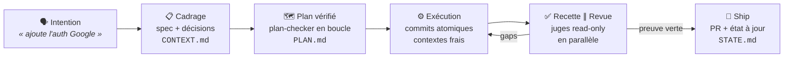
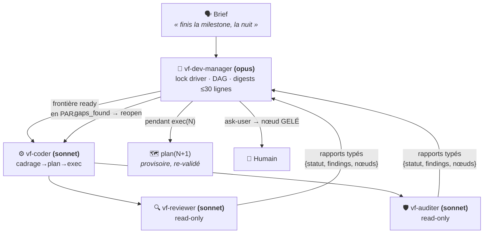
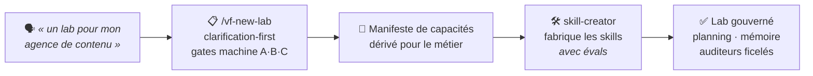

<div align="center">

# VibeFlow OS

[English](./README.md) · **Français**

**Claude Code est puissant. VibeFlow le rend fiable, économe et gouverné.**

Orchestration agentique **spec-driven** pour Claude Code : tu parles normalement, un agent
détecte l'intention, déroule le pipeline (cadrage → plan → exécution → preuve), et des **gates
machine** vérifient — pas des promesses.

[](./VERSION)
[](https://docs.claude.com/en/docs/claude-code)
[](#-modules)
[](./LICENSE)

[Le cycle dev](#-le-cycle-dev--spec-driven) · [Missions](#-missions-longues--léquipe) · [Labs & design](#-au-delà-du-dev--un-lab-pour-chaque-métier) · [Mémoire](#-la-mémoire-qui-tient) · [Installation](#-installation) · [Modules](#-modules)

</div>

---

## Le problème

Les setups IA échouent à l'échelle pour trois raisons : le **context rot** (la qualité se
dégrade à mesure que le contexte gonfle), l'**improvisation** (l'agent code sans spec, vérifie
de mémoire, s'auto-valide), et les **tokens brûlés** (tout en contexte, tout relu, tout en
modèle premium).

VibeFlow attaque les trois : **le disque est la source de vérité** (specs, plans, état — pas
le contexte), **rien n'est « fait » sans preuve machine** (tests, gates, juges frais), et
**chaque token a un rôle** (workers sonnet, digests, chargement on-demand, dispatch parallèle).

---

## 🔁 Le cycle dev — spec-driven

Dis _« ajoute l'auth Google »_ : l'agent `vibeflow-dev` détecte l'intention et invoque la
brique outillée (chaîne GSD). Chaque étape **laisse un artefact sur disque** — le contexte
peut mourir, le projet continue.



- **Cadrage avant plan, preuve avant done** : un critère d'UI mobile n'est pas « fait » tant
  qu'un flow Maestro n'est pas passé sur simulateur — pas juste un test unitaire vert.
- **Recherche doc avant debug** (ADR-045) : un bug de lib se cherche dans les issues et
  release notes avant de tâtonner.
- **Le juge n'est jamais l'auteur** : revue et audit tournent dans des agents **sans droit
  d'écriture** — cloisonnement par les tools, pas par la prose.

---

## 🤖 Missions longues — l'équipe

« Fais les étapes 3 à 5, je reviens demain matin. » Au-delà du seuil, un **manager de
mission** prend le relais sur le **team-kernel** — la conversation principale reste légère.



Le contrôle de flux est **déterministe** : rapports typés (jamais d'interprétation de prose),
5 halt conditions, anti-thrash (3 essais), anti-régression (revert automatique), et tout ce
qui défie l'intention ou la sécurité **gèle le nœud** et remonte à l'humain — même à 3 h du
matin. Le même kernel fait tourner **6 équipes** : dev, design, mobile, content, growth,
business.

### L'efficience, chiffrée

| Levier | Effet |
|---|---|
| **Workers & juges en sonnet**, opus réservé au manager | le gros du volume au juste prix |
| **Digest de mission ≤ 30 lignes** par mandat | ~100-200k tokens de relecture évités par étape |
| **Dispatch parallèle** : juges ∥, nœuds DAG disjoints ∥ | le mur d'attente séquentiel tombe |
| **Pipelining N/N+1** : cadrage+plan de l'étape suivante pendant l'exécution | zéro temps mort entre étapes |
| **Chargement on-demand** (règle du 1 %) | doctrine hors contexte tant qu'elle ne sert pas |

---

## 🧪 Au-delà du dev — un lab pour chaque métier

VibeFlow n'est pas un outil dev-only : il **fabrique des labs** — des espaces de travail
gouvernés pour n'importe quel métier — sur le même kernel et les mêmes gates.



- **Création de lab** (`/vf-new-lab`, conductor) — cadrage clarification-first sous gates
  machine, manifeste de capacités dérivé pour le métier, skills fabriqués par `skill-creator`
  (boucle d'évals), auditeurs ficelés en sortie. **Mode express : lab opérationnel en
  ≤ 15 minutes** (3 questions, dérivations assumées et marquées) — recetté en conditions
  réelles.
- **Design** (`design-orchestrator`, installé avec le dev) — dis *« rends ça plus beau »*,
  *« cet écran est fade »* ou *« audite cette page »* : l'agent `vibeflow-design` route
  l'intention vers le bon geste (direction artistique, craft ciblé, critique scorée). Les
  missions design complètes tournent en équipe — manager + crafter + **juge frais** qui score
  /100 contre ta direction artistique. **Multi-stack** : il livre des specs et des tokens,
  jamais du code verrouillé sur un framework.
- **Bundles métier** (`content` · `growth` · `business-pilot`) — équipes complètes sur le
  team-kernel, juges read-only à critères éliminatoires, proposés au catalogue de
  `/vf-new-lab`. La promesse multi-métier est livrée, pas en roadmap.
- **KPIs** (`kpi-analyst`) — les chiffres du lab pour tout métier : arbres de métriques,
  cadences de revue, alertes de dérive.

Chaque module embarque une **documentation niveau framework dans son README** —
installation, démarrer, usage, référence complète — liée depuis
[le tableau des modules](#-modules).


---

## 🧠 La mémoire qui tient

Un lab VibeFlow n'oublie pas entre deux sessions — et sa mémoire ne pourrit pas :

- **Registres indexés** (`DECISIONS` / `LEARNINGS` / `BLOCKERS` / `JOURNAL` / `EVALS`) :
  lecture **index-first imposée par hook** — on ne recharge jamais un registre entier.
- **Mémoire d'agents** (`memory: project`) : le manager et les workers capitalisent
  cross-session.
- **Consolidator** : archivage par statut/âge, fusion des doublons, **promotion**
  learning → règle (validation humaine), décroissance de confiance par demi-vie.
- **Les artefacts comme API** : `PROJECT.md`, `ROADMAP.md`, `STATE.md`, plans et specs —
  n'importe quelle session repart d'un disque à jour, pas d'un contexte compacté.

---

## 🏗 Architecture


Les autres métiers se **fabriquent** sur ce socle — voir
[Au-delà du dev — un lab pour chaque métier](#-au-delà-du-dev--un-lab-pour-chaque-métier).

---

## 🚀 Installation

Deux commandes, zéro clone, zéro édition de config :

```bash
claude plugin marketplace add picmakpro/vibeflow-os
claude plugin install vibeflow
```

Puis dans Claude Code : `/vibeflow-install` — scope pré-détecté (confirmation en une touche),
choix des modules, dépendances résolues et récapitulées avant toute pose. Mise à jour :
`/vf-update`. Détails : [INSTALL.md](./INSTALL.md).

---

## 📦 Modules

17 modules, chacun versionné avec son `CHANGELOG.md`. À l'install : `conductor` est le
**socle obligatoire** (avec son filet planning-core / validator / consolidator /
infrastructure-audit / audit-architecture), puis un choix — *lab de dev* ou *lab métier sur
mesure*. Les **3 bundles métier sont proposés** au catalogue ; mobile-test et
mobile-test-team restent en à-la-carte avancé.

**Le README de chaque module est sa documentation complète** — même structure partout : ce
qu'il fait, installation, démarrer, usage, référence exhaustive, limites. Clique un module
ci-dessous pour ouvrir sa doc.

<details>
<summary><strong>Les 17 modules en détail</strong></summary>

| Module | Ver. | Type | Ce qu'il fait |
|--------|:----:|------|---------------|
| **[conductor](./plugin/conductor/)** | `1.14.1` | agent + skills + scripts + references | 🧭 La porte d'entrée. Agent méta `vibeflow-conductor` (gardien) : crée/configure un lab dans **n'importe quel métier** (`vf-new-lab`, bundle-aware), installe/vérifie/met à jour, migre sur évolution de doctrine (`vf-calibrate`), reçoit les escalades de cohérence. Héberge le **team-kernel** et les gates. |
| **[dev-orchestrator](./plugin/dev-orchestrator/)** | `2.1.1` | agent + skills + scripts | ⭐ Le cœur dev, **modèle agentique** (v2, breaking) : l'agent `vibeflow-dev` détecte l'intention et invoque **directement** les briques GSD (carte d'intention unique, on-demand), propose les next steps, garde le first-use. Équipe de mission `vf-dev-manager` (DAG + lock de driver + rapports typés + digest de mission) avec workers sonnet `vf-coder`/`vf-reviewer`/`vf-auditer`, dispatch parallèle revue ∥ audit, garde-fous de boucle autonome. Deux skills survivants : `vf-auto` (porte d'autonomie) et `vf-dev` (incarner l'agent). Installe `design-orchestrator` d'office. |
| **[design-orchestrator](./plugin/design-orchestrator/)** | `1.2.1` | agent + skills | 🎨 Le compagnon design. Agent routeur `vibeflow-design` + `/vf-design` et `/vf-sketch` + **équipe de mission design** (`vf-design-manager` + `vf-crafter` + juge frais `vf-design-judge`, rubric /100 contre la DA). **Générique multi-stack** — produit des specs + tokens, pas du code framework-locké. Installé d'office avec `dev-orchestrator`. |
| **[mobile-test](./plugin/mobile-test/)** | `1.0.1` | skill + script + config | 📱 Test réel d'app mobile (simulateur iOS / émulateur Android) : détection de cible, build-si-absent, régression Maestro, rapport horodaté + artefacts, diagnostic visuel des échecs via `mobile-mcp`. **Expérimental** jusqu'au premier vrai run vert. |
| **[mobile-test-team](./plugin/mobile-test-team/)** | `1.4.0` | agents + rules | 🤖 Boucle autonome test→fix mobile : `vf-test-orchestrator` (porte sa recherche doc, ADR-045 en 1 saut) + workers cloisonnés par outils (`vf-test-runner` / `vf-app-fixer`, Pattern 12) — le mode autonome atteint « l'app marche vraiment ». Requiert `mobile-test`. **Expérimental**. |
| **[software-architecture](./plugin/software-architecture/)** | `1.5.2` | skill + rules + scripts | Doctrine d'architecture logicielle AI-Safe + **foyer des philosophies de dev** : SOLID, DRY, KISS, YAGNI, Clean Architecture, Clean Code, carte TDD ; anti-god-files (≤300 L), gates *machine-enforced* (**Nyquist + Decision Coverage**), playbook brownfield. |
| **[audit-architecture](./plugin/audit-architecture/)** | `1.0.1` | skill + references | Concepteur d'**architecture d'audit** : dérive depuis un brief la structure d'audit multi-couches d'un process (contenu / dossier / code / vente). |
| **[infrastructure-audit](./plugin/infrastructure-audit/)** | `1.2.1` | skill + scripts | Audit automatique de l'infra Claude Code (hooks, scripts, drift Anthropic) — détecte les régressions après une mise à jour. |
| **[validator](./plugin/validator/)** | `1.3.1` | agent-only | Agent `vibeflow-validator` : garant de l'alignement technique méthodo ↔ projets, en 5 phases — **proportionné au profil du lab** (Phase 4 opt-in en profil léger). |
| **[consolidator](./plugin/consolidator/)** | `1.8.0` | skill + scripts | Consolidation de la mémoire structurée : indexation / archivage / fusion / promotion + mémoire vivante (décroissance par demi-vie, supersession non destructive) + **templates de registres embarqués**. |
| **[skill-creator](./plugin/skill-creator/)** | `1.0.2` | agent + skills | Fabrique de capacités de lab avec **eval-loop** (recherche par facettes → draft → évals) — le moteur de la Lab Factory. |
| **[reference](./plugin/reference/)** | `2.5.1` | doc-only | Documentation méthodologique complète : VibeFlow Core (9 principes) + 12 patterns (dont le cloisonnement par outils) + templates + 1 exemple de bout en bout. |
| **[planning-core](./plugin/planning-core/)** | `2.5.1` | skill + references + scripts | Socle de planning & documentation du lab non-dev + **altitude lab** partout (index des projets, compartiments, dette, pont mémoire). Sur un projet de code, le planning appartient au moteur de dev : redirection, jamais de format concurrent (ADR-055). |
| **[kpi-analyst](./plugin/kpi-analyst/)** | `1.0.2` | agent + skill + scripts + references | 📈 Déduit les **vrais KPIs métier** d'un lab : schéma stable validé une fois + valeurs extraites de façon déterministe (registre `KPIS.md`, standalone ou Hub externe optionnel). Jamais de chiffre inventé. |
| 📦 **[business-pilot-bundle](./plugin/business-pilot-bundle/)** | `2.0.1` | agents + skill + scripts | Bundle métier, **équipe complète sur le team-kernel** : `vf-business-manager` + workers commercial/delivery/finance + juge `quality-gate-client` (périmètre vendu et montants sourcés éliminatoires, seuil 80). Double Iron Law : aucun envoi client sans validation humaine, aucun chiffre financier inventé. Skill d'entrée `vf-business`. |
| 📦 **[content-bundle](./plugin/content-bundle/)** | `2.0.1` | agents + skill + scripts | Bundle métier, **équipe complète sur le team-kernel** : `vf-content-manager` + workers strategist/writer/repurposer + `content-clarity-judge` (chiffres sourcés éliminatoires, seuil 80). Publication toujours human-gated. Skill d'entrée `vf-content`. |
| 📦 **[growth-bundle](./plugin/growth-bundle/)** | `2.0.1` | agents + skill + scripts | Bundle métier, **équipe complète sur le team-kernel** : `vf-growth-manager` + workers channel-strategist/copywriter/analyst + `growth-quality-judge` (claims sourcés et consentement/anti-spam éliminatoires). Tout envoi réel (email, dépense pub, outreach) human-gated ; métriques sourcées ou `low`. Skill d'entrée `vf-growth`. |

</details>

**Points d'entrée livrés** : les commandes `/vibeflow` (conductor) · `/vf-new-lab` ·
`/vf-planning` · `/vf-calibrate` · `/vf-audit` · `/vf-update` (bandeau de mise à jour au
démarrage), plus le skill `/vibeflow-install` (UX à toggles du premier lancement). Les agents
ne se tapent pas directement — ce sont leurs points d'entrée explicites.

---

## 🔒 Confiance

- **Source-available** : code et historique publics — voir [LICENSE](./LICENSE).
- **Auditable** : bash + `jq`, chaque script couvert par sa suite (`45 suites` en CI), install
  **idempotente** avec backup avant écrasement.
- **Le repo s'applique sa propre doctrine** : CI sur push/PR (tests + gates stricts) + job
  « **lab frais** » — la baseline est installée dans un lab vierge et doit passer ses propres
  gates sans intervention.
- **Zéro hook au niveau plugin** : rien ne s'exécute tant que tu n'invoques pas. Les hooks de
  gouvernance des modules sont posés par `/vibeflow-install`, sous tes yeux.
- **Anti-hallucination par design** : le routage s'appuie sur un index factuel auto-généré
  depuis le disque ; les modules incomplets sont marqués `proposable:false`, jamais vendus.

---

## 🧭 Versioning

**Semver par module** + version racine taguée à chaque release (`check-release-tag` en gate).
Historique complet : **[CHANGELOG.md](./CHANGELOG.md)** — le README garde les 3 dernières :

| Version | Date | Changement |
|---------|------|------------|
| `v2.45.0` | 2026-07-31 | **VibeFlow aligné sur `@opengsd/gsd-core` 1.9.0** — origine : la mise à jour du moteur de 1.8.0 vers 1.9.0 le 2026-07-31, delta établi sur pièce (`npm pack` des deux versions, diff intégral, vérification de l'installation vivante). Le seul défaut actif : `inject-mcp-tools.sh` ne découvrait les serveurs MCP que via `./.mcp.json` — un serveur déclaré uniquement en **scope global** (`~/.claude.json`, ex. XcodeBuildMCP) restait invisible, `--verify` sortait en `3` INDÉTERMINÉ au lieu de signaler le manque. Corrigé par une **union de deux scopes** (projet ∪ global, `--claude-json`/`VF_CLAUDE_JSON`), dégradation indépendante par source, précédence projet > global sur collision. Livrés aussi : le contrat amont `estimate:`/`actuals:` relayé verbatim par `vf-coder`/`vf-dev-manager` (jamais une statistique auto-évaluée) ; **ADR-061**, arbitrage écrit du recouvrement entre les lanes de revue cross-AI amont et l'étage de revue de code livré en 20-06 (deux objets distincts, gardés séparés) ; l'hypothèse datée du dispatch nommé consignée dans `team-kernel.md`, recoupée avec `gsd-worktree-path-guard.js` (#1995, #2608 — vérifiés conformes) ; la purge de la dette de version 1.8.0 → 1.9.0 sur 6 fichiers, en déplaçant le cas de test à chaîne littérale (cas 8) avec le texte qu'il vérifie, jamais neutralisé ; **ADR-062**, arbitrage des 2 hooks 1.9.0 non câblés (absence correcte dans les deux cas) ; et **`check-state-integrity.sh`** (**ADR-063**) — nouveau gate anti-régression du frontmatter de `.planning/STATE.md`, désormais câblé au job `gates` de la CI, fermant la classe exacte de régression silencieuse (`completed_phases`/`total_plans`/`completed_plans` en baisse au sein du même jalon) découverte après la clôture de la Phase 20. Modules `dev-orchestrator` v2.9.0, `planning-core` v2.5.3, `conductor` v1.18.0 (inchangé, vérifié cohérent). **45 suites** vertes, `check-agents --strict` vert sur les 6 dossiers d'agents. |
| `v2.44.0` | 2026-07-31 | **La revue devient un étage de premier rang, piloté par le manager** (**ADR-060**) : elle sort du cycle interne de `vf-coder`, qui cesse d'être juge de son propre travail — le manager dispatche `vf-reviewer` et tient lui-même la boucle correction → re-revue. Origine : le **second rapport d'audit externe** du 2026-07-28 (lab tiers, tranche iOS en 5 lots dont 2 parallélisés, ~90 commits, suite 177 → 331 tests), dont les 4 constats ont été **vérifiés sur pièce avant ouverture** — 3 confirmés dont 2 **plus solidement que le rapport ne l'affirmait**, 1 partiellement daté. **ADR-051 révisée sur son seul point contesté** : la prémisse « les agents de revue ne compilent jamais » confondait **produire** un verdict de compilation et **en vérifier** un. `vf-reviewer` reçoit une allowlist MCP **nommée** (`vf-mcp-tools`, grammaire `<serveur>:<outil…>`) — jamais le joker de serveur, moindre privilège préservé — et la révision porte son **prix écrit noir sur blanc** (~90 s de plus par revue, un slot de simulateur). **La barrière d'écriture des 4 juges cesse d'être une fiction** : l'absence de `Write`/`Edit` dans `tools:` était rouverte **silencieusement au runtime** par `memory: project` (prouvé par sonde) — ils portent désormais `disallowedTools: Write, Edit`, une contrainte réelle, sans qu'une ligne du gate n'ait bougé. `vf-design-judge`, seul à conserver `Bash`, **cesse d'affirmer une barrière qu'il n'a pas** et nomme son angle mort : canal shell ouvert, retenue qui reste un engagement de prompt. Trois garde-fous non négociables encadrent tout allègement, tirés des chiffres de l'audit : **jamais réduire le nombre de tests** (mesuré : sur 90 s de build, les tests pèsent ~1 s — levier nul), **jamais alléger la revue sur le chemin critique produit** (5 bloquants trouvés en une journée), et **aucun allègement ne s'applique à un diff de comblement** (9 puis 5 puis 4 défauts nés des correctifs de revue eux-mêmes). Livrés aussi : `--scope` et `review_regime` (périmètres gelés), `check-mission-invariants.sh` + `.planning/MISSION-INVARIANTS.md` (gate de zone morte), et le périmètre explicite des hooks tiers (`--third-party-prefix`). Modules `conductor` v1.17.0, `dev-orchestrator` v2.8.0, `design-orchestrator` v1.3.2, les 3 bundles v2.0.3. **44 suites** vertes, `check-agents --strict` vert sur les 6 dossiers d'agents. |
| `v2.43.1` | 2026-07-28 | **Une mission d'équipe travaille sur sa propre branche, jamais sur la branche par défaut** (**ADR-059**). Dès qu'un manager est dispatché (`vf-dev-manager`, `vf-design-manager`), il crée sa branche **avant son premier commit**, y tient tous ses commits et termine par une **PR laissée ouverte** — il ne merge jamais, le merge appartient à l'utilisateur (ADR-031 appliqué à l'intégration). Origine : sur ce dépôt même, une mission autonome a produit **32 commits directement sur `main`**, poussés puis taggés ; le recours en cas de mission ratée était un `revert` en masse d'un historique déjà public. Sur une branche, le recours est de **ne pas merger**, et la PR fournit le point de relecture groupée qu'un rapport de fin de mission — rédigé par l'agent qui a fait le travail, et lu trop tard — ne remplace pas. Le déclencheur est le **dispatch d'un manager**, pas la nature du travail : le travail conversationnel direct reste hors de la règle. Cinq replis garantissent qu'une mission n'échoue **jamais** faute d'appliquer la règle (pas de dépôt git · pas de remote · `gh` absent · **arbre sale = halt condition**, jamais un `stash` décidé seul · `CLAUDE.md` du projet cible qui prime). Ne couvre pas l'isolation des vagues parallèles **à l'intérieur** d'une mission — seul `isolation: worktree` le ferait, décision laissée ouverte. Modules `dev-orchestrator` v2.7.1, `design-orchestrator` v1.3.1. |
| `v2.43.0` | 2026-07-28 | Le moteur GSD entre dans le périmètre de `/vf-update` (**ADR-058**) : la migration `get-shit-done-cc` → `@opengsd/gsd-core` livrée en v2.39.0 n'atteignait **aucun poste déjà équipé** — seulement les installations neuves. Constaté sur un poste tiers : plugin à jour en 2.42.0, moteur toujours à 1.42.3 posé **12 jours** plus tôt, sans que rien dans l'interface ne le dise. Trois causes enchaînées, toutes fermées. `detect_gsd()` renvoyait vrai sur le layout legacy via un `||` écrit pour la tolérance dual-layout, et en faisait un `skip` : il devient un état à **trois valeurs** (`absent`/`legacy`/`gsd-core`) où « legacy » est **actionnable**. Aucun chemin de mise à jour n'appelait le script d'installation : `check-gsd-engine.sh` (nouveau gate, contrat F13) est sondé par `/vf-update` — et **avant** son arrêt « VibeFlow est à jour », sans quoi un poste au plugin à jour ne voyait jamais la proposition. Le message de nettoyage legacy, jusqu'ici joignable par `/vf-init` seul, devient atteignable et **exact** : `npm uninstall -g` n'est plus proposé que si le paquet est réellement global, l'arborescence vide laissée par l'installeur est incluse, et l'état est capturé **avant** l'install — l'installeur amont supprimant lui-même le `VERSION` legacy, le message ne pouvait plus jamais sortir après coup. Piège acté noir sur blanc : le fork **repart de zéro**, donc **1.8.0 < 1.42.3 en semver** — la migration se décide sur le **nom du paquet et le layout**, jamais sur la comparaison des numéros, et un test fixe ce couple exact. ADR-031 tenu de bout en bout : détecter et **proposer**, jamais installer ni nettoyer sans accord. `ensure-deps.sh --migrate-engine` enchaîne sur la ré-injection MCP (l'installeur amont classe l'injection ADR-051 en « local patch » et efface `mcp__XcodeBuildMCP__*` du `tools:` de `gsd-executor`), et `inject-mcp-tools.sh --verify` compare le `tools:` final aux serveurs du `.mcp.json`. Ce dernier a d'abord été livré **inerte** — appelé sans `--force`, il écartait sa propre cible et sortait toujours en 3 — défaut validé par la revue, le gate de portabilité **et** l'audit sécurité, débusqué par la seule mutation du bloc livré. |
| `v2.42.0` | 2026-07-28 | Signaux de démarrage du moteur de dev : `dev-orchestrator` — seul module structurant **sans aucun hook** — reçoit son premier fragment `hooks/hooks.json`. Trois scripts en lecture seule et **advisory** constatent des FAITS au `SessionStart` et injectent des lignes courtes et auto-portantes. `check-dev-bootstrap.sh` couvre tout le continuum de démarrage en un seul script (silence · `onboard` si du code sans `.planning/` · `bootstrap` listant les items manquants · orientation `gsd-engine` si complet), signaux prouvés mutuellement exclusifs par test. `discover-unintegrated-docs.sh --hook` agrège le compte de façon **additive**, sans toucher à son contrat historique `grain<TAB>chemin` ; `check-doc-drift.sh` signale les commits de code qui distancent la mise à jour de doc au-delà d'un seuil réglable (défaut 20). Le signal `gsd-engine` ferme le trou de routage constaté le 2026-07-27 — `planning-core` se retire quand GSD tient le projet et aucun module ne prenait le relais. Portabilité **prouvée par exécution** : compteurs identiques sur macOS bash 3.2.57, Debian 12 et Ubuntu 24.04, ce qui exclut le test sauté silencieusement. Deux cas de test tautologiques débusqués et tués par mutation. |
| `v2.41.0` | 2026-07-27 | Cloisonnement complet des dispatches : `check-agents.sh` lint désormais le **contenu** du champ `tools:` — syntaxe des allowlists et existence des noms, sur `tools:` comme `disallowedTools:` (jusqu'ici, noms d'agents inventés, parenthèse non fermée et outils inexistants passaient tous `--strict` en vert ; suite 38 → 58 axes). La sévérité est indexée sur ce qui est vérifiable indépendamment du périmètre installé, de sorte que les types natifs (`general-purpose`) et les agents externes `gsd-*` ne rendent jamais rouge une allowlist correcte — le monde fermé est un mode opt-in réservé à la CI. Allowlists posées sur les 3 workers dev après double recensement indépendant. Correction doctrinale : dans la définition d'un sous-agent, le runtime **ignore** les noms entre parenthèses — une allowlist est un contrat documenté enforcé par ce lint seul, pas un bac à sable runtime. |
| `v2.40.0` | 2026-07-27 | Collaboration croisée dev ↔ design sous un seul manager : `vf-dev-manager` insère des nœuds `craft:`/`critique:` dans une mission dev (étage sauté et signalé quand la direction artistique manque), `vf-design-manager` gagne un étage d'implémentation opt-in avec double juge (re-critique DA ∥ revue de code) et budgets anti-thrash séparés 3 + 3, `vf-auto` aiguille enfin les missions purement design vers le manager design, et les deux managers portent une allowlist `Agent(...)` (18 / 6 noms) qui interdit l'imbrication manager→manager (contrat documenté — voir la correction v2.41.0 sur ce qu'une allowlist enforce réellement). Kernel intact. |

<details>
<summary><strong>Références méthodologiques (ADR / LRN)</strong></summary>

- **ADR-032** — Système de consolidation mémoire 4 piliers
- **ADR-035** — Doctrine architecture logicielle AI-Safe
- **ADR-053** — Volet swarm : lock de driver + DAG + rapports typés
- **ADR-055** — Frontière d'altitude planning lab ↔ moteur de dev
- **ADR-056** — Vigilance support runtime
- **ADR-057** — Frontières outillées avec les briques tierces
- **LRN-101** — Pattern « agent minimal + skills composables »
- **LRN-106** — Audit avant fix

Lab principal (privé) : [vibeflow-lab](https://github.com/picmakpro/vibeflow-lab) — les modifications structurantes y sont testées avant release.

</details>

---

## 👤 Auteurs

- **[@picmakpro](https://github.com/picmakpro)** — créateur de la méthodologie VibeFlow et propriétaire du repo. A posé les fondations du projet et reste le gardien de sa doctrine : le socle de gouvernance (`conductor`, `planning-core`, `consolidator`), les hooks et guards scripturaux qui gardent chaque lab honnête. L'identité de VibeFlow — une gouvernance tenue par les outils, pas par la prose — c'est lui.
- **Samuel Neveu — [@samuel-neveugall](https://github.com/samuel-neveugall)** — la force motrice du projet au quotidien : contributeur principal et pilote des releases. A construit tout le versant développement (`dev-orchestrator`, `design-orchestrator`, `mobile-test-team`), mené la bascule agentique et le team-kernel, et conduit l'évolution du framework — dont sa migration sur le moteur `@opengsd/gsd-core`.

## 📄 Licence

Source-available sous licence propriétaire — voir [LICENSE](./LICENSE). Code et historique
publics ; les élèves de la formation disposent d'un droit de réutilisation privée ;
redistribution et revente interdites. Le module `skill-creator` réutilise du contenu Anthropic
original sous licence MIT.
