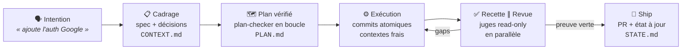
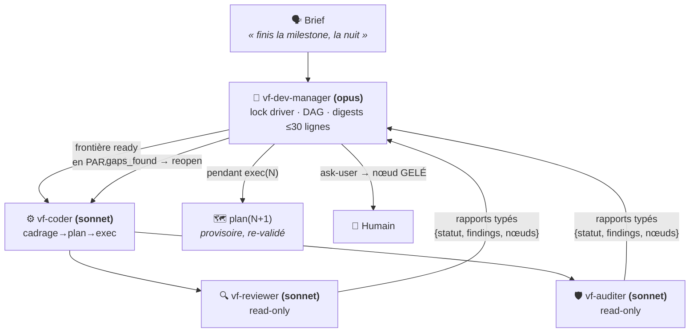
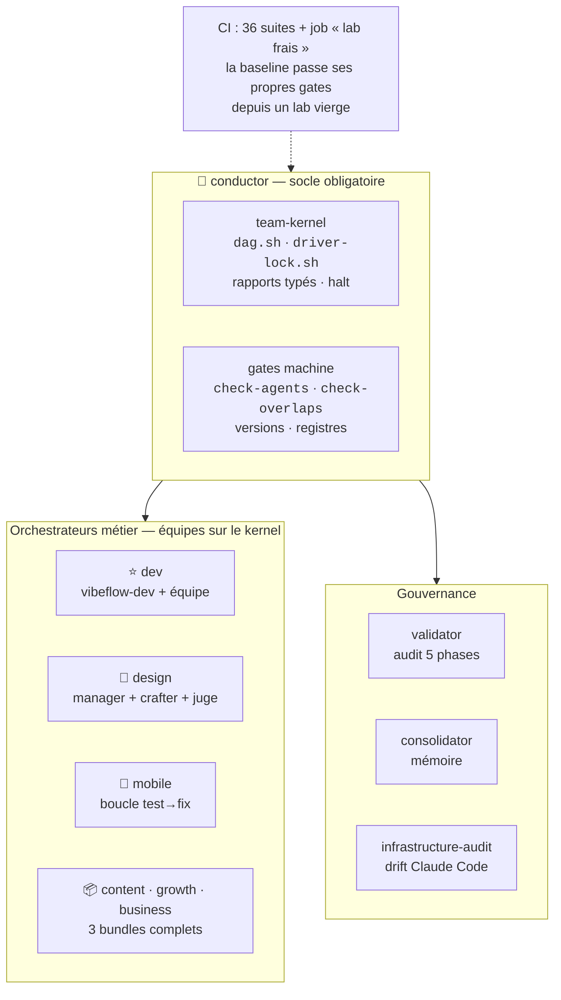

<div align="center">

# VibeFlow OS

[English](./README.md) · **Français**

**Claude Code est puissant. VibeFlow le rend fiable, économe et gouverné.**

Orchestration agentique **spec-driven** pour Claude Code : tu parles normalement, un agent
détecte l'intention, déroule le pipeline (cadrage → plan → exécution → preuve), et des **gates
machine** vérifient — pas des promesses.

[](./VERSION)
[](https://docs.claude.com/en/docs/claude-code)
[](#-modules)
[](./LICENSE)

[Le cycle dev](#-le-cycle-dev--spec-driven) · [Missions](#-missions-longues--léquipe) · [Mémoire](#-la-mémoire-qui-tient) · [Installation](#-installation) · [Modules](#-modules)

</div>

---

## Le problème

Les setups IA échouent à l'échelle pour trois raisons : le **context rot** (la qualité se
dégrade à mesure que le contexte gonfle), l'**improvisation** (l'agent code sans spec, vérifie
de mémoire, s'auto-valide), et les **tokens brûlés** (tout en contexte, tout relu, tout en
modèle premium).

VibeFlow attaque les trois : **le disque est la source de vérité** (specs, plans, état — pas
le contexte), **rien n'est « fait » sans preuve machine** (tests, gates, juges frais), et
**chaque token a un rôle** (workers sonnet, digests, chargement on-demand, dispatch parallèle).

---

## 🔁 Le cycle dev — spec-driven

Dis _« ajoute l'auth Google »_ : l'agent `vibeflow-dev` détecte l'intention et invoque la
brique outillée (chaîne GSD). Chaque étape **laisse un artefact sur disque** — le contexte
peut mourir, le projet continue.



- **Cadrage avant plan, preuve avant done** : un critère d'UI mobile n'est pas « fait » tant
  qu'un flow Maestro n'est pas passé sur simulateur — pas juste un test unitaire vert.
- **Recherche doc avant debug** (ADR-045) : un bug de lib se cherche dans les issues et
  release notes avant de tâtonner.
- **Le juge n'est jamais l'auteur** : revue et audit tournent dans des agents **sans droit
  d'écriture** — cloisonnement par les tools, pas par la prose.

---

## 🤖 Missions longues — l'équipe

« Fais les étapes 3 à 5, je reviens demain matin. » Au-delà du seuil, un **manager de
mission** prend le relais sur le **team-kernel** — la conversation principale reste légère.



Le contrôle de flux est **déterministe** : rapports typés (jamais d'interprétation de prose),
5 halt conditions, anti-thrash (3 essais), anti-régression (revert automatique), et tout ce
qui défie l'intention ou la sécurité **gèle le nœud** et remonte à l'humain — même à 3 h du
matin. Le même kernel fait tourner **6 équipes** : dev, design, mobile, content, growth,
business.

### L'efficience, chiffrée

| Levier | Effet |
|---|---|
| **Workers & juges en sonnet**, opus réservé au manager | le gros du volume au juste prix |
| **Digest de mission ≤ 30 lignes** par mandat | ~100-200k tokens de relecture évités par étape |
| **Dispatch parallèle** : juges ∥, nœuds DAG disjoints ∥ | le mur d'attente séquentiel tombe |
| **Pipelining N/N+1** : cadrage+plan de l'étape suivante pendant l'exécution | zéro temps mort entre étapes |
| **Chargement on-demand** (règle du 1 %) | doctrine hors contexte tant qu'elle ne sert pas |

---

## 🧠 La mémoire qui tient

Un lab VibeFlow n'oublie pas entre deux sessions — et sa mémoire ne pourrit pas :

- **Registres indexés** (`DECISIONS` / `LEARNINGS` / `BLOCKERS` / `JOURNAL` / `EVALS`) :
  lecture **index-first imposée par hook** — on ne recharge jamais un registre entier.
- **Mémoire d'agents** (`memory: project`) : le manager et les workers capitalisent
  cross-session.
- **Consolidator** : archivage par statut/âge, fusion des doublons, **promotion**
  learning → règle (validation humaine), décroissance de confiance par demi-vie.
- **Les artefacts comme API** : `PROJECT.md`, `ROADMAP.md`, `STATE.md`, plans et specs —
  n'importe quelle session repart d'un disque à jour, pas d'un contexte compacté.

---

## 🏗 Architecture



Les autres métiers se **fabriquent** : `/vf-new-lab` clarifie, dérive un manifeste de
capacités, fait fabriquer les skills par `skill-creator` (avec évals), et ficelle les
auditeurs. **Mode express : lab opérationnel en ≤ 15 minutes** (3 questions, dérivations
assumées et marquées, gates intacts) — recetté en conditions réelles.

---

## 🚀 Installation

Deux commandes, zéro clone, zéro édition de config :

```bash
claude plugin marketplace add picmakpro/vibeflow-os
claude plugin install vibeflow
```

Puis dans Claude Code : `/vibeflow-install` — scope pré-détecté (confirmation en une touche),
choix des modules, dépendances résolues et récapitulées avant toute pose. Mise à jour :
`/vf-update`. Détails : [INSTALL.md](./INSTALL.md).

---

## 📦 Modules

17 modules, chacun versionné avec son `CHANGELOG.md`. À l'install : `conductor` est le
**socle obligatoire** (avec son filet planning-core / validator / consolidator /
infrastructure-audit / audit-architecture), puis un choix — *lab de dev* ou *lab métier sur
mesure*. Les **3 bundles métier sont proposés** au catalogue ; mobile-test et
mobile-test-team restent en à-la-carte avancé.

<details>
<summary><strong>Les 17 modules en détail</strong></summary>

| Module | Ver. | Type | Ce qu'il fait |
|--------|:----:|------|---------------|
| **[conductor](./plugin/conductor/)** | `1.14.1` | agent + skills + scripts + references | 🧭 La porte d'entrée. Agent méta `vibeflow-conductor` (gardien) : crée/configure un lab dans **n'importe quel métier** (`vf-new-lab`, bundle-aware), installe/vérifie/met à jour, migre sur évolution de doctrine (`vf-calibrate`), reçoit les escalades de cohérence. Héberge le **team-kernel** et les gates. |
| **[dev-orchestrator](./plugin/dev-orchestrator/)** | `2.1.1` | agent + skills + scripts | ⭐ Le cœur dev, **modèle agentique** (v2, breaking) : l'agent `vibeflow-dev` détecte l'intention et invoque **directement** les briques GSD (carte d'intention unique, on-demand), propose les next steps, garde le first-use. Équipe de mission `vf-dev-manager` (DAG + lock de driver + rapports typés + digest de mission) avec workers sonnet `vf-coder`/`vf-reviewer`/`vf-auditer`, dispatch parallèle revue ∥ audit, garde-fous de boucle autonome. Deux skills survivants : `vf-auto` (porte d'autonomie) et `vf-dev` (incarner l'agent). Installe `design-orchestrator` d'office. |
| **[design-orchestrator](./plugin/design-orchestrator/)** | `1.2.1` | agent + skills | 🎨 Le compagnon design. Agent routeur `vibeflow-design` + `/vf-design` et `/vf-sketch` + **équipe de mission design** (`vf-design-manager` + `vf-crafter` + juge frais `vf-design-judge`, rubric /100 contre la DA). **Générique multi-stack** — produit des specs + tokens, pas du code framework-locké. Installé d'office avec `dev-orchestrator`. |
| **[mobile-test](./plugin/mobile-test/)** | `1.0.1` | skill + script + config | 📱 Test réel d'app mobile (simulateur iOS / émulateur Android) : détection de cible, build-si-absent, régression Maestro, rapport horodaté + artefacts, diagnostic visuel des échecs via `mobile-mcp`. **Expérimental** jusqu'au premier vrai run vert. |
| **[mobile-test-team](./plugin/mobile-test-team/)** | `1.4.0` | agents + rules | 🤖 Boucle autonome test→fix mobile : `vf-test-orchestrator` (porte sa recherche doc, ADR-045 en 1 saut) + workers cloisonnés par outils (`vf-test-runner` / `vf-app-fixer`, Pattern 12) — le mode autonome atteint « l'app marche vraiment ». Requiert `mobile-test`. **Expérimental**. |
| **[software-architecture](./plugin/software-architecture/)** | `1.5.2` | skill + rules + scripts | Doctrine d'architecture logicielle AI-Safe + **foyer des philosophies de dev** : SOLID, DRY, KISS, YAGNI, Clean Architecture, Clean Code, carte TDD ; anti-god-files (≤300 L), gates *machine-enforced* (**Nyquist + Decision Coverage**), playbook brownfield. |
| **[audit-architecture](./plugin/audit-architecture/)** | `1.0.1` | skill + references | Concepteur d'**architecture d'audit** : dérive depuis un brief la structure d'audit multi-couches d'un process (contenu / dossier / code / vente). |
| **[infrastructure-audit](./plugin/infrastructure-audit/)** | `1.2.1` | skill + scripts | Audit automatique de l'infra Claude Code (hooks, scripts, drift Anthropic) — détecte les régressions après une mise à jour. |
| **[validator](./plugin/validator/)** | `1.3.1` | agent-only | Agent `vibeflow-validator` : garant de l'alignement technique méthodo ↔ projets, en 5 phases — **proportionné au profil du lab** (Phase 4 opt-in en profil léger). |
| **[consolidator](./plugin/consolidator/)** | `1.8.0` | skill + scripts | Consolidation de la mémoire structurée : indexation / archivage / fusion / promotion + mémoire vivante (décroissance par demi-vie, supersession non destructive) + **templates de registres embarqués**. |
| **[skill-creator](./plugin/skill-creator/)** | `1.0.2` | agent + skills | Fabrique de capacités de lab avec **eval-loop** (recherche par facettes → draft → évals) — le moteur de la Lab Factory. |
| **[reference](./plugin/reference/)** | `2.5.1` | doc-only | Documentation méthodologique complète : VibeFlow Core (9 principes) + 12 patterns (dont le cloisonnement par outils) + templates + 1 exemple de bout en bout. |
| **[planning-core](./plugin/planning-core/)** | `2.5.1` | skill + references + scripts | Socle de planning & documentation du lab non-dev + **altitude lab** partout (index des projets, compartiments, dette, pont mémoire). Sur un projet de code, le planning appartient au moteur de dev : redirection, jamais de format concurrent (ADR-055). |
| **[kpi-analyst](./plugin/kpi-analyst/)** | `1.0.2` | agent + skill + scripts + references | 📈 Déduit les **vrais KPIs métier** d'un lab : schéma stable validé une fois + valeurs extraites de façon déterministe (registre `KPIS.md`, standalone ou Hub externe optionnel). Jamais de chiffre inventé. |
| 📦 **[business-pilot-bundle](./plugin/business-pilot-bundle/)** | `2.0.1` | agents + skill + scripts | Bundle métier, **équipe complète sur le team-kernel** : `vf-business-manager` + workers commercial/delivery/finance + juge `quality-gate-client` (périmètre vendu et montants sourcés éliminatoires, seuil 80). Double Iron Law : aucun envoi client sans validation humaine, aucun chiffre financier inventé. Skill d'entrée `vf-business`. |
| 📦 **[content-bundle](./plugin/content-bundle/)** | `2.0.1` | agents + skill + scripts | Bundle métier, **équipe complète sur le team-kernel** : `vf-content-manager` + workers strategist/writer/repurposer + `content-clarity-judge` (chiffres sourcés éliminatoires, seuil 80). Publication toujours human-gated. Skill d'entrée `vf-content`. |
| 📦 **[growth-bundle](./plugin/growth-bundle/)** | `2.0.1` | agents + skill + scripts | Bundle métier, **équipe complète sur le team-kernel** : `vf-growth-manager` + workers channel-strategist/copywriter/analyst + `growth-quality-judge` (claims sourcés et consentement/anti-spam éliminatoires). Tout envoi réel (email, dépense pub, outreach) human-gated ; métriques sourcées ou `low`. Skill d'entrée `vf-growth`. |

</details>

**Commandes livrées** : `/vibeflow` (conductor) · `/vf-new-lab` · `/vf-planning` ·
`/vf-calibrate` · `/vf-audit` · `/vibeflow-install` · `/vf-update` (bandeau de mise à jour au
démarrage). Les agents ne se tapent pas directement — ces commandes sont leurs points
d'entrée.

---

## 🔒 Confiance

- **Source-available** : code et historique publics — voir [LICENSE](./LICENSE).
- **Auditable** : bash + `jq`, chaque script couvert par sa suite (`36 suites` en CI), install
  **idempotente** avec backup avant écrasement.
- **Le repo s'applique sa propre doctrine** : CI sur push/PR (tests + gates stricts) + job
  « **lab frais** » — la baseline est installée dans un lab vierge et doit passer ses propres
  gates sans intervention.
- **Zéro hook au niveau plugin** : rien ne s'exécute tant que tu n'invoques pas. Les hooks de
  gouvernance des modules sont posés par `/vibeflow-install`, sous tes yeux.
- **Anti-hallucination par design** : le routage s'appuie sur un index factuel auto-généré
  depuis le disque ; les modules incomplets sont marqués `proposable:false`, jamais vendus.

---

## 🧭 Versioning

**Semver par module** + version racine taguée à chaque release (`check-release-tag` en gate).
Historique complet : **[CHANGELOG.md](./CHANGELOG.md)** — le README garde les 3 dernières :

| Version | Date | Changement |
|---------|------|------------|
| `v2.36.1` | 2026-07-26 | Refonte vitrine des README : dev-first, 3 diagrammes mermaid (cycle spec-driven, équipe de mission, architecture), efficience/mémoire en avant, tableau des modules replié — et nouvel invariant de gate : l'historique en tête doit être la VERSION courante. |
| `v2.36.0` | 2026-07-26 | Recettes réelles (UAT) sur labs vierges (mode express ✓ sous 15 min ; protocole de mission exécutable par un agent tiers ✓) — 16 frictions corrigées, doctrine `human_needed` tranchée (geler le nœud), job CI « lab frais » : la baseline doit passer ses propres gates depuis un lab vierge. |
| `v2.35.0` | 2026-07-25 | Promesse multi-métier tenue : les 3 bundles métier sont des modules réels (content / growth / business-pilot v2.0.0, équipes complètes sur le team-kernel, juges read-only à critères éliminatoires, `quality-gate-client` livré). |

<details>
<summary><strong>Références méthodologiques (ADR / LRN)</strong></summary>

- **ADR-032** — Système de consolidation mémoire 4 piliers
- **ADR-035** — Doctrine architecture logicielle AI-Safe
- **ADR-053** — Volet swarm : lock de driver + DAG + rapports typés
- **ADR-055** — Frontière d'altitude planning lab ↔ moteur de dev
- **ADR-056** — Vigilance support runtime
- **ADR-057** — Frontières outillées avec les briques tierces
- **LRN-101** — Pattern « agent minimal + skills composables »
- **LRN-106** — Audit avant fix

Lab principal (privé) : [vibeflow-lab](https://github.com/picmakpro/vibeflow-lab) — les modifications structurantes y sont testées avant release.

</details>

---

## 👤 Auteurs

- **[@picmakpro](https://github.com/picmakpro)** — créateur et mainteneur de la méthodologie VibeFlow et de la plupart des modules (gouvernance, audits, `skill-creator`, `consolidator`, `reference`…). Propriétaire du repo.
- **Samuel Neveu — [@samuel-neveugall](https://github.com/samuel-neveugall)** — partie workflow de développement : le module `dev-orchestrator` et l'expérience langage naturel → pipeline.

## 📄 Licence

Source-available sous licence propriétaire — voir [LICENSE](./LICENSE). Code et historique
publics ; les élèves de la formation disposent d'un droit de réutilisation privée ;
redistribution et revente interdites. Le module `skill-creator` réutilise du contenu Anthropic
original sous licence MIT.
