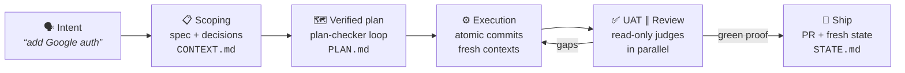
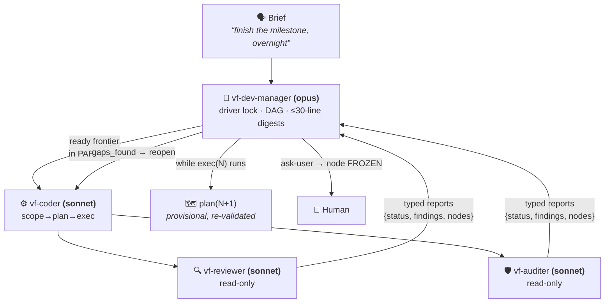
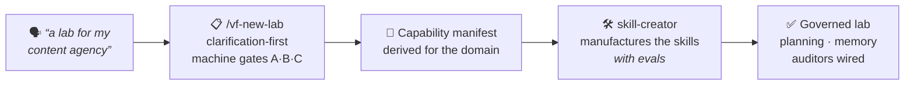
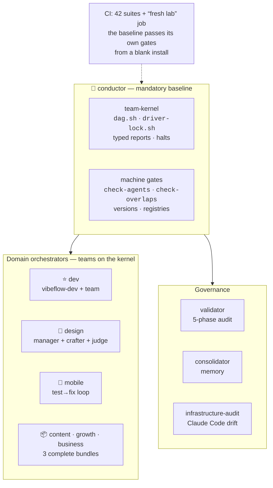

<div align="center">

# VibeFlow OS

**English** · [Français](./README.fr.md)

**Claude Code is powerful. VibeFlow makes it reliable, frugal and governed.**

**Spec-driven** agentic orchestration for Claude Code: you speak plainly, an agent detects the
intent, runs the pipeline (scoping → plan → execution → proof), and **machine gates** verify —
not promises.

[](./VERSION)
[](https://docs.claude.com/en/docs/claude-code)
[](#-modules)
[](./LICENSE)

[The dev cycle](#-the-dev-cycle--spec-driven) · [Missions](#-long-missions--the-team) · [Labs & design](#-beyond-dev--a-lab-for-any-domain) · [Memory](#-memory-that-holds) · [Install](#-install) · [Modules](#-modules)

</div>

---

## The problem

AI coding setups fail at scale for three reasons: **context rot** (quality degrades as the
context window fills), **improvisation** (the agent codes without a spec, verifies from
memory, validates itself), and **burned tokens** (everything in context, everything re-read,
everything on the premium model).

VibeFlow attacks all three: **disk is the source of truth** (specs, plans, state — not the
context window), **nothing is "done" without machine proof** (tests, gates, fresh judges),
and **every token has a job** (sonnet workers, digests, on-demand loading, parallel dispatch).

---

## 🔁 The dev cycle — spec-driven

Say _"add Google auth"_: the `vibeflow-dev` agent detects the intent and invokes the tooled
brick (GSD toolchain). Every step **leaves an artifact on disk** — the context can die, the
project carries on.



- **Scope before plan, proof before done**: a mobile UI criterion isn't "done" until a
  Maestro flow passes on a simulator — not just a green unit test.
- **Doc research before debugging** (ADR-045): a library bug gets looked up in issues and
  release notes before trial-and-error.
- **The judge is never the author**: review and audit run in agents **without write access**
  — enforcement by tools, not by prose.

---

## 🤖 Long missions — the team

"Do steps 3 to 5, I'm back tomorrow morning." Past the threshold, a **mission manager**
takes over on the **team-kernel** — the main conversation stays light.



Flow control is **deterministic**: typed reports (never prose interpretation), 5 halt
conditions, anti-thrash (3 attempts), anti-regression (automatic revert), and anything that
challenges intent or security **freezes the node** and escalates to the human — even at 3 AM.
The same kernel powers **6 teams**: dev, design, mobile, content, growth, business.

### Efficiency, quantified

| Lever | Effect |
|---|---|
| **Sonnet workers & judges**, opus reserved for the manager | bulk volume at the right price |
| **Mission digest ≤ 30 lines** per mandate | ~100-200k re-reading tokens saved per step |
| **Parallel dispatch**: judges ∥, disjoint DAG nodes ∥ | the sequential wait-wall falls |
| **N/N+1 pipelining**: next step scoped+planned during current execution | zero dead time between steps |
| **On-demand loading** (1% rule) | doctrine stays out of context until it's needed |

---

## 🧪 Beyond dev — a lab for any domain

VibeFlow is not a dev-only tool: it **manufactures labs** — governed workspaces for any
domain — on the same kernel and the same gates.



- **Lab creation** (`/vf-new-lab`, conductor) — clarification-first scoping under machine
  gates, a capability manifest derived for the domain, skills built by `skill-creator` (eval
  loop), auditors wired at the end. **Express mode: operational lab in ≤ 15 minutes**
  (3 questions, assumed-and-flagged derivations) — validated through real-world UAT.
- **Design** (`design-orchestrator`, installed with dev) — say *"make it beautiful"*, *"this
  screen is bland"* or *"audit this page"*: the `vibeflow-design` agent routes the intent to
  the right gesture (art direction, targeted craft, scored critique). Full design missions run
  a team — manager + crafter + **fresh judge** scoring /100 against your art direction.
  **Stack-agnostic**: it ships specs and tokens, never framework-locked code.
- **Domain bundles** (`content` · `growth` · `business-pilot`) — complete teams on the
  team-kernel, read-only judges with eliminatory criteria, offered in the `/vf-new-lab`
  catalog. The multi-domain promise is shipped, not roadmapped.
- **KPIs** (`kpi-analyst`) — the lab's numbers for any domain: metric trees, review cadences,
  drift alerts.

Each module ships **framework-grade documentation in its README** — installation, get
started, usage, full reference — linked from [the modules table](#-modules).


---

## 🧠 Memory that holds

A VibeFlow lab doesn't forget between sessions — and its memory doesn't rot:

- **Indexed registries** (`DECISIONS` / `LEARNINGS` / `BLOCKERS` / `JOURNAL` / `EVALS`):
  **index-first reads enforced by hook** — a full registry is never reloaded.
- **Agent memory** (`memory: project`): the manager and workers capitalize across sessions.
- **Consolidator**: archiving by status/age, duplicate merging, learning → rule **promotion**
  (human-validated), confidence decay by category half-life.
- **Artifacts as API**: `PROJECT.md`, `ROADMAP.md`, `STATE.md`, plans and specs — any session
  restarts from a fresh disk, not a compacted context.

---

## 🏗 Architecture



Other domains are **manufactured** on this base — see
[Beyond dev — a lab for any domain](#-beyond-dev--a-lab-for-any-domain).

---

## 🚀 Install

Two commands, no clone, no config editing:

```bash
claude plugin marketplace add picmakpro/vibeflow-os
claude plugin install vibeflow
```

Then inside Claude Code: `/vibeflow-install` — pre-detected scope (one-tap confirmation),
module picker, dependencies resolved and recapped before anything is written. Update:
`/vf-update`. Details: [INSTALL.md](./INSTALL.md).

---

## 📦 Modules

17 modules, each versioned with its own `CHANGELOG.md`. At install: `conductor` is the
**mandatory baseline** (with its safety net planning-core / validator / consolidator /
infrastructure-audit / audit-architecture), then one choice — *dev lab* or *tailor-made
domain lab*. The **3 domain bundles are offered** in the catalog; mobile-test and
mobile-test-team stay as advanced à-la-carte add-ons.

**Each module's README is its full documentation** — same structure everywhere: what it does,
installation, get started, usage, complete reference, limits. Click a module below to open its
docs.

<details>
<summary><strong>The 17 modules in detail</strong></summary>

| Module | Ver. | Type | What it does |
|--------|:----:|------|--------------|
| **[conductor](./plugin/conductor/)** | `1.14.1` | agent + skills + scripts + references | 🧭 The front door. Meta agent `vibeflow-conductor` (guardian): create/configure a lab in **any domain** (`vf-new-lab`, bundle-aware), install/verify/update, migrate on doctrine change (`vf-calibrate`), receive coherence escalations. Hosts the **team-kernel** and the gates. |
| **[dev-orchestrator](./plugin/dev-orchestrator/)** | `2.1.1` | agent + skills + scripts | ⭐ The dev core, **agentic model** (v2, breaking): agent `vibeflow-dev` detects intent and invokes GSD bricks **directly** (single intent map, on-demand), proposes next steps, guards first-use. Mission team `vf-dev-manager` (DAG + driver lock + typed reports + mission digest) with sonnet workers `vf-coder`/`vf-reviewer`/`vf-auditer`, parallel review ∥ audit dispatch, autonomous-loop guardrails. Two surviving skills: `vf-auto` (autonomy gateway) and `vf-dev` (embody the agent). Installs `design-orchestrator` by default. |
| **[design-orchestrator](./plugin/design-orchestrator/)** | `1.2.1` | agent + skills | 🎨 The design companion. Router agent `vibeflow-design` + `/vf-design` and `/vf-sketch` + **design mission team** (`vf-design-manager` + `vf-crafter` + fresh judge `vf-design-judge`, /100 rubric against the art direction). **Stack-agnostic** — outputs specs + tokens, not framework-locked code. Installed by default with `dev-orchestrator`. |
| **[mobile-test](./plugin/mobile-test/)** | `1.0.1` | skill + script + config | 📱 Real mobile app testing (iOS simulator / Android emulator): target detection, build-if-missing, Maestro regression, timestamped report + artifacts, visual failure diagnosis via `mobile-mcp`. **Experimental** until the first real green run. |
| **[mobile-test-team](./plugin/mobile-test-team/)** | `1.4.0` | agents + rules | 🤖 Autonomous mobile test→fix loop: `vf-test-orchestrator` (carries its own doc research, ADR-045 in 1 hop) + tool-partitioned workers (`vf-test-runner` / `vf-app-fixer`, Pattern 12) — autonomy reaches "the app actually works". Requires `mobile-test`. **Experimental**. |
| **[software-architecture](./plugin/software-architecture/)** | `1.5.2` | skill + rules + scripts | AI-Safe software architecture doctrine + **home of dev philosophies**: SOLID, DRY, KISS, YAGNI, Clean Architecture, Clean Code, TDD map; anti-god-files (≤300 L), *machine-enforced* gates (**Nyquist + Decision Coverage**), brownfield playbook. |
| **[audit-architecture](./plugin/audit-architecture/)** | `1.0.1` | skill + references | **Audit-architecture** designer: derives from a brief the multi-layer audit structure of a process (content / dossier / code / sales). |
| **[infrastructure-audit](./plugin/infrastructure-audit/)** | `1.2.1` | skill + scripts | Automatic Claude Code infra audit (hooks, scripts, Anthropic drift) — catches regressions after an update. |
| **[validator](./plugin/validator/)** | `1.3.1` | agent-only | Agent `vibeflow-validator`: guards methodology ↔ project alignment in 5 phases — **proportioned to the lab profile** (Phase 4 opt-in on light profile). |
| **[consolidator](./plugin/consolidator/)** | `1.8.0` | skill + scripts | Structured memory consolidation: indexing / archiving / merging / promotion + living memory (half-life confidence decay, non-destructive supersession) + **bundled registry templates**. |
| **[skill-creator](./plugin/skill-creator/)** | `1.0.2` | agent + skills | Lab capability factory with an **eval loop** (facet research → draft → evals) — the engine of the Lab Factory. |
| **[reference](./plugin/reference/)** | `2.5.1` | doc-only | Complete methodology documentation: VibeFlow Core (9 principles) + 12 patterns (incl. tool partitioning) + templates + 1 end-to-end example. |
| **[planning-core](./plugin/planning-core/)** | `2.5.1` | skill + references + scripts | Non-dev lab planning & documentation backbone + **lab altitude** everywhere (project index, typed compartments, debt, memory bridge). On a code project, planning belongs to the dev engine: it redirects, never competes (ADR-055). |
| **[kpi-analyst](./plugin/kpi-analyst/)** | `1.0.2` | agent + skill + scripts + references | 📈 Derives a lab's **real business KPIs**: stable schema validated once + deterministically extracted values (`KPIS.md` registry, standalone or optional external Hub). Never an invented figure. |
| 📦 **[business-pilot-bundle](./plugin/business-pilot-bundle/)** | `2.0.1` | agents + skill + scripts | Métier bundle, **full team on the team-kernel**: `vf-business-manager` + commercial/delivery/finance workers + `quality-gate-client` judge (sold-scope & sourced-amounts eliminatory, threshold 80). Twin Iron Laws: no client send without human validation, no invented financial figure. Entry skill `vf-business`. |
| 📦 **[content-bundle](./plugin/content-bundle/)** | `2.0.1` | agents + skill + scripts | Métier bundle, **full team on the team-kernel**: `vf-content-manager` + strategist/writer/repurposer workers + `content-clarity-judge` (sourced-figures eliminatory, threshold 80). Publication always human-gated. Entry skill `vf-content`. |
| 📦 **[growth-bundle](./plugin/growth-bundle/)** | `2.0.1` | agents + skill + scripts | Métier bundle, **full team on the team-kernel**: `vf-growth-manager` + channel-strategist/copywriter/analyst workers + `growth-quality-judge` (sourced claims & consent/anti-spam eliminatory). Every real send (email, ad spend, outreach) human-gated; metrics sourced or `low`. Entry skill `vf-growth`. |

</details>

**Shipped entry points**: commands `/vibeflow` (conductor) · `/vf-new-lab` · `/vf-planning` ·
`/vf-calibrate` · `/vf-audit` · `/vf-update` (update banner at session start), plus the
`/vibeflow-install` skill (first-launch toggles UX). Agents are never invoked directly — these
are their explicit entry points.

---

## 🔒 Trust

- **Source-available**: public code and history — see [LICENSE](./LICENSE).
- **Auditable**: bash + `jq`, every script covered by its suite (42 suites in CI),
  **idempotent** install with backup before overwrite.
- **The repo applies its own doctrine**: CI on push/PR (tests + strict gates) + a
  "**fresh lab**" job — the baseline is installed into a blank lab and must pass its own
  gates with zero intervention.
- **Zero plugin-level hooks**: nothing runs until you invoke it. Module governance hooks are
  written by `/vibeflow-install`, in plain sight.
- **Anti-hallucination by design**: routing relies on a factual index auto-generated from
  disk; incomplete modules are flagged `proposable:false`, never sold.

---

## 🧭 Versioning

**Semver per module** + tagged root version on every release (`check-release-tag` as a gate).
Full history: **[CHANGELOG.md](./CHANGELOG.md)** — the README keeps the last 3 entries:

| Version | Date | Change |
|---------|------|--------|
| `v2.43.0` | 2026-07-28 | The GSD engine enters `/vf-update`'s scope (**ADR-058**): the `get-shit-done-cc` → `@opengsd/gsd-core` migration shipped in v2.39.0 reached **no already-equipped machine** — only fresh installs. Observed on a third-party machine: plugin current at 2.42.0, engine still at 1.42.3 laid down **12 days** earlier, with nothing in the interface saying so. Three chained causes, all closed. `detect_gsd()` returned true on the legacy layout through an `||` written for dual-layout tolerance, and turned that into a `skip`: it becomes a **three-valued** state (`absent`/`legacy`/`gsd-core`) where "legacy" is **actionable**. No update path ever called the install script: `check-gsd-engine.sh` (new gate, F13 contract) is now probed by `/vf-update` — and **before** its "VibeFlow is up to date" stop, without which a machine with a current plugin never saw the offer. The legacy cleanup message, previously reachable through `/vf-init` alone, becomes reachable and **accurate**: `npm uninstall -g` is offered only when the package is genuinely global, the empty tree left behind by the installer is included, and the state is captured **before** the install — since the upstream installer deletes the legacy `VERSION` itself, the message could otherwise never fire again. Trap recorded in plain words: the fork **restarts from zero**, so **1.8.0 < 1.42.3 in semver** — migration is decided on the **package name and the directory layout**, never on comparing numbers, and a test pins that exact pair. ADR-031 upheld throughout: detect and **offer**, never install or clean without consent. `ensure-deps.sh --migrate-engine` chains into MCP re-injection (the upstream installer files the ADR-051 injection as a "local patch" and erases `mcp__XcodeBuildMCP__*` from `gsd-executor`'s `tools:`), and `inject-mcp-tools.sh --verify` compares the final `tools:` against the servers in `.mcp.json`. That last one first shipped **inert** — called without `--force`, it excluded its own target and always exited 3 — a defect cleared by code review, the portability gate **and** the security audit, caught only by mutating the shipped block. |
| `v2.42.0` | 2026-07-28 | Startup signals for the dev engine: `dev-orchestrator` — the only structuring module with **no hook at all** — gains its first `hooks/hooks.json` fragment. Three read-only, advisory `SessionStart` scripts state FACTS and inject short self-carrying lines. `check-dev-bootstrap.sh` covers the whole start continuum in one script (silence · `onboard` when code has no `.planning/` · `bootstrap` listing what is missing · `gsd-engine` orientation when complete), the signals proven mutually exclusive by test. `discover-unintegrated-docs.sh --hook` aggregates the count **additively**, leaving its historical `grain<TAB>path` contract untouched; `check-doc-drift.sh` flags code commits outstripping doc updates past a tunable threshold (default 20). The `gsd-engine` signal closes the routing hole observed on 2026-07-27 — `planning-core` steps aside when GSD holds a project and nothing took over. Portability **proven by execution**: identical counters on macOS bash 3.2.57, Debian 12 and Ubuntu 24.04, which rules out the silently skipped test. Two tautological test cases found and killed by mutation. |
| `v2.41.0` | 2026-07-27 | Agent dispatch fully fenced: `check-agents.sh` now lints the **contents** of `tools:` — allowlist syntax and name existence, on `tools:` and `disallowedTools:` alike (invented agent names, unclosed parens and non-existent tools all passed `--strict` green until now; suite 38 → 58 axes). Severity is graded by what is verifiable regardless of the installed scope, so native types (`general-purpose`) and external `gsd-*` agents never turn a correct allowlist red — closed-world checking is an opt-in CI mode. Allowlists posted on the 3 dev workers after a double independent census. Doctrinal correction: in a subagent definition the runtime **ignores** the names in parentheses — an allowlist is a documented contract enforced by this lint alone, not a runtime sandbox. |
| `v2.40.0` | 2026-07-27 | Cross-team dev ↔ design collaboration under a single manager: `vf-dev-manager` inserts `craft:`/`critique:` nodes into a dev mission (design stage skipped and reported when no art direction exists), `vf-design-manager` gains an opt-in implementation stage with dual judge (art-direction re-score ∥ code review) and separate 3 + 3 anti-thrash budgets, `vf-auto` finally routes design-only missions to the design manager, and both managers carry `Agent(...)` allowlists (18 / 6 names) forbidding manager→manager nesting (a documented contract — see the v2.41.0 correction on what an allowlist actually enforces). Kernel untouched. |

<details>
<summary><strong>Methodology references (ADR / LRN)</strong></summary>

- **ADR-032** — 4-pillar memory consolidation system
- **ADR-035** — AI-Safe software architecture doctrine
- **ADR-053** — Swarm layer: driver lock + DAG + typed reports
- **ADR-055** — Altitude boundary lab planning ↔ dev engine
- **ADR-056** — Runtime support vigilance
- **ADR-057** — Tooled boundaries with third-party bricks
- **LRN-101** — "Minimal agent + composable skills" pattern
- **LRN-106** — Audit before fix

Main lab (private): [vibeflow-lab](https://github.com/picmakpro/vibeflow-lab) — structural changes are tested there before release.

</details>

---

## 👤 Authors

- **[@picmakpro](https://github.com/picmakpro)** — creator of the VibeFlow methodology and repo owner. Laid the project's foundations and remains the guardian of its doctrine: the governance backbone (`conductor`, `planning-core`, `consolidator`), the scriptural hooks and guards that keep every lab honest. VibeFlow's identity — governance enforced by tools, not by prose — is his.
- **Samuel Neveu — [@samuel-neveugall](https://github.com/samuel-neveugall)** — the project's driving force day to day: main contributor and release driver. Built the entire development side (`dev-orchestrator`, `design-orchestrator`, `mobile-test-team`), led the agentic pivot and the team-kernel, and steers the framework's evolution — including its migration onto the `@opengsd/gsd-core` engine.

## 📄 License

Source-available under a proprietary license — see [LICENSE](./LICENSE). Public code and
history; training students get a private-reuse right; redistribution and resale prohibited.
The `skill-creator` module reuses original Anthropic content under the MIT license.
