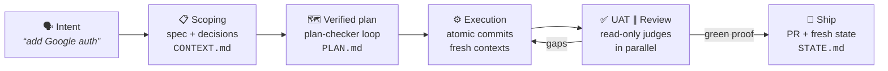
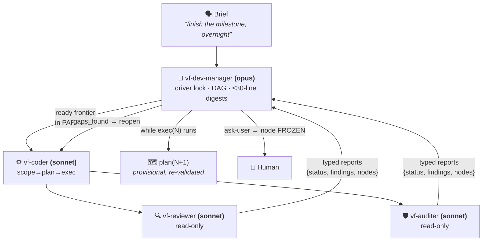
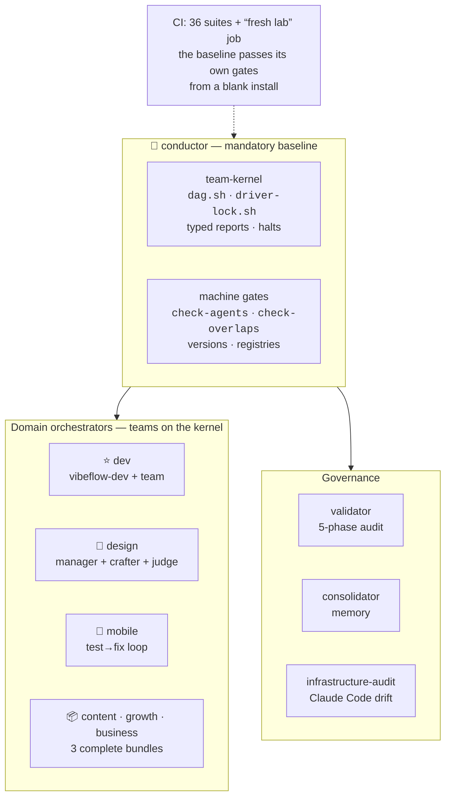

<div align="center">

# VibeFlow OS

**English** · [Français](./README.fr.md)

**Claude Code is powerful. VibeFlow makes it reliable, frugal and governed.**

**Spec-driven** agentic orchestration for Claude Code: you speak plainly, an agent detects the
intent, runs the pipeline (scoping → plan → execution → proof), and **machine gates** verify —
not promises.

[](./VERSION)
[](https://docs.claude.com/en/docs/claude-code)
[](#-modules)
[](./LICENSE)

[The dev cycle](#-the-dev-cycle--spec-driven) · [Missions](#-long-missions--the-team) · [Memory](#-memory-that-holds) · [Install](#-install) · [Modules](#-modules)

</div>

---

## The problem

AI coding setups fail at scale for three reasons: **context rot** (quality degrades as the
context window fills), **improvisation** (the agent codes without a spec, verifies from
memory, validates itself), and **burned tokens** (everything in context, everything re-read,
everything on the premium model).

VibeFlow attacks all three: **disk is the source of truth** (specs, plans, state — not the
context window), **nothing is "done" without machine proof** (tests, gates, fresh judges),
and **every token has a job** (sonnet workers, digests, on-demand loading, parallel dispatch).

---

## 🔁 The dev cycle — spec-driven

Say _"add Google auth"_: the `vibeflow-dev` agent detects the intent and invokes the tooled
brick (GSD toolchain). Every step **leaves an artifact on disk** — the context can die, the
project carries on.



- **Scope before plan, proof before done**: a mobile UI criterion isn't "done" until a
  Maestro flow passes on a simulator — not just a green unit test.
- **Doc research before debugging** (ADR-045): a library bug gets looked up in issues and
  release notes before trial-and-error.
- **The judge is never the author**: review and audit run in agents **without write access**
  — enforcement by tools, not by prose.

---

## 🤖 Long missions — the team

"Do steps 3 to 5, I'm back tomorrow morning." Past the threshold, a **mission manager**
takes over on the **team-kernel** — the main conversation stays light.



Flow control is **deterministic**: typed reports (never prose interpretation), 5 halt
conditions, anti-thrash (3 attempts), anti-regression (automatic revert), and anything that
challenges intent or security **freezes the node** and escalates to the human — even at 3 AM.
The same kernel powers **6 teams**: dev, design, mobile, content, growth, business.

### Efficiency, quantified

| Lever | Effect |
|---|---|
| **Sonnet workers & judges**, opus reserved for the manager | bulk volume at the right price |
| **Mission digest ≤ 30 lines** per mandate | ~100-200k re-reading tokens saved per step |
| **Parallel dispatch**: judges ∥, disjoint DAG nodes ∥ | the sequential wait-wall falls |
| **N/N+1 pipelining**: next step scoped+planned during current execution | zero dead time between steps |
| **On-demand loading** (1% rule) | doctrine stays out of context until it's needed |

---

## 🧠 Memory that holds

A VibeFlow lab doesn't forget between sessions — and its memory doesn't rot:

- **Indexed registries** (`DECISIONS` / `LEARNINGS` / `BLOCKERS` / `JOURNAL` / `EVALS`):
  **index-first reads enforced by hook** — a full registry is never reloaded.
- **Agent memory** (`memory: project`): the manager and workers capitalize across sessions.
- **Consolidator**: archiving by status/age, duplicate merging, learning → rule **promotion**
  (human-validated), confidence decay by category half-life.
- **Artifacts as API**: `PROJECT.md`, `ROADMAP.md`, `STATE.md`, plans and specs — any session
  restarts from a fresh disk, not a compacted context.

---

## 🏗 Architecture



Other domains are **manufactured**: `/vf-new-lab` clarifies, derives a capability manifest,
has `skill-creator` build the skills (with evals), and wires the auditors. **Express mode:
operational lab in ≤ 15 minutes** (3 questions, assumed and flagged derivations, gates
intact) — validated through real-world UAT.

---

## 🚀 Install

Two commands, no clone, no config editing:

```bash
claude plugin marketplace add picmakpro/vibeflow-os
claude plugin install vibeflow
```

Then inside Claude Code: `/vibeflow-install` — pre-detected scope (one-tap confirmation),
module picker, dependencies resolved and recapped before anything is written. Update:
`/vf-update`. Details: [INSTALL.md](./INSTALL.md).

---

## 📦 Modules

17 modules, each versioned with its own `CHANGELOG.md`. At install: `conductor` is the
**mandatory baseline** (with its safety net planning-core / validator / consolidator /
infrastructure-audit / audit-architecture), then one choice — *dev lab* or *tailor-made
domain lab*. The **3 domain bundles are offered** in the catalog; mobile-test and
mobile-test-team stay as advanced à-la-carte add-ons.

<details>
<summary><strong>The 17 modules in detail</strong></summary>

| Module | Ver. | Type | What it does |
|--------|:----:|------|--------------|
| **[conductor](./plugin/conductor/)** | `1.14.1` | agent + skills + scripts + references | 🧭 The front door. Meta agent `vibeflow-conductor` (guardian): create/configure a lab in **any domain** (`vf-new-lab`, bundle-aware), install/verify/update, migrate on doctrine change (`vf-calibrate`), receive coherence escalations. Hosts the **team-kernel** and the gates. |
| **[dev-orchestrator](./plugin/dev-orchestrator/)** | `2.1.1` | agent + skills + scripts | ⭐ The dev core, **agentic model** (v2, breaking): agent `vibeflow-dev` detects intent and invokes GSD bricks **directly** (single intent map, on-demand), proposes next steps, guards first-use. Mission team `vf-dev-manager` (DAG + driver lock + typed reports + mission digest) with sonnet workers `vf-coder`/`vf-reviewer`/`vf-auditer`, parallel review ∥ audit dispatch, autonomous-loop guardrails. Two surviving skills: `vf-auto` (autonomy gateway) and `vf-dev` (embody the agent). Installs `design-orchestrator` by default. |
| **[design-orchestrator](./plugin/design-orchestrator/)** | `1.2.1` | agent + skills | 🎨 The design companion. Router agent `vibeflow-design` + `/vf-design` and `/vf-sketch` + **design mission team** (`vf-design-manager` + `vf-crafter` + fresh judge `vf-design-judge`, /100 rubric against the art direction). **Stack-agnostic** — outputs specs + tokens, not framework-locked code. Installed by default with `dev-orchestrator`. |
| **[mobile-test](./plugin/mobile-test/)** | `1.0.1` | skill + script + config | 📱 Real mobile app testing (iOS simulator / Android emulator): target detection, build-if-missing, Maestro regression, timestamped report + artifacts, visual failure diagnosis via `mobile-mcp`. **Experimental** until the first real green run. |
| **[mobile-test-team](./plugin/mobile-test-team/)** | `1.4.0` | agents + rules | 🤖 Autonomous mobile test→fix loop: `vf-test-orchestrator` (carries its own doc research, ADR-045 in 1 hop) + tool-partitioned workers (`vf-test-runner` / `vf-app-fixer`, Pattern 12) — autonomy reaches "the app actually works". Requires `mobile-test`. **Experimental**. |
| **[software-architecture](./plugin/software-architecture/)** | `1.5.2` | skill + rules + scripts | AI-Safe software architecture doctrine + **home of dev philosophies**: SOLID, DRY, KISS, YAGNI, Clean Architecture, Clean Code, TDD map; anti-god-files (≤300 L), *machine-enforced* gates (**Nyquist + Decision Coverage**), brownfield playbook. |
| **[audit-architecture](./plugin/audit-architecture/)** | `1.0.1` | skill + references | **Audit-architecture** designer: derives from a brief the multi-layer audit structure of a process (content / dossier / code / sales). |
| **[infrastructure-audit](./plugin/infrastructure-audit/)** | `1.2.1` | skill + scripts | Automatic Claude Code infra audit (hooks, scripts, Anthropic drift) — catches regressions after an update. |
| **[validator](./plugin/validator/)** | `1.3.1` | agent-only | Agent `vibeflow-validator`: guards methodology ↔ project alignment in 5 phases — **proportioned to the lab profile** (Phase 4 opt-in on light profile). |
| **[consolidator](./plugin/consolidator/)** | `1.8.0` | skill + scripts | Structured memory consolidation: indexing / archiving / merging / promotion + living memory (half-life confidence decay, non-destructive supersession) + **bundled registry templates**. |
| **[skill-creator](./plugin/skill-creator/)** | `1.0.2` | agent + skills | Lab capability factory with an **eval loop** (facet research → draft → evals) — the engine of the Lab Factory. |
| **[reference](./plugin/reference/)** | `2.5.1` | doc-only | Complete methodology documentation: VibeFlow Core (9 principles) + 12 patterns (incl. tool partitioning) + templates + 1 end-to-end example. |
| **[planning-core](./plugin/planning-core/)** | `2.5.1` | skill + references + scripts | Non-dev lab planning & documentation backbone + **lab altitude** everywhere (project index, typed compartments, debt, memory bridge). On a code project, planning belongs to the dev engine: it redirects, never competes (ADR-055). |
| **[kpi-analyst](./plugin/kpi-analyst/)** | `1.0.2` | agent + skill + scripts + references | 📈 Derives a lab's **real business KPIs**: stable schema validated once + deterministically extracted values (`KPIS.md` registry, standalone or optional external Hub). Never an invented figure. |
| 📦 **[business-pilot-bundle](./plugin/business-pilot-bundle/)** | `2.0.1` | agents + skill + scripts | Métier bundle, **full team on the team-kernel**: `vf-business-manager` + commercial/delivery/finance workers + `quality-gate-client` judge (sold-scope & sourced-amounts eliminatory, threshold 80). Twin Iron Laws: no client send without human validation, no invented financial figure. Entry skill `vf-business`. |
| 📦 **[content-bundle](./plugin/content-bundle/)** | `2.0.1` | agents + skill + scripts | Métier bundle, **full team on the team-kernel**: `vf-content-manager` + strategist/writer/repurposer workers + `content-clarity-judge` (sourced-figures eliminatory, threshold 80). Publication always human-gated. Entry skill `vf-content`. |
| 📦 **[growth-bundle](./plugin/growth-bundle/)** | `2.0.1` | agents + skill + scripts | Métier bundle, **full team on the team-kernel**: `vf-growth-manager` + channel-strategist/copywriter/analyst workers + `growth-quality-judge` (sourced claims & consent/anti-spam eliminatory). Every real send (email, ad spend, outreach) human-gated; metrics sourced or `low`. Entry skill `vf-growth`. |

</details>

**Shipped commands**: `/vibeflow` (conductor) · `/vf-new-lab` · `/vf-planning` ·
`/vf-calibrate` · `/vf-audit` · `/vibeflow-install` · `/vf-update` (update banner at session
start). Agents are never invoked directly — these commands are their explicit entry points.

---

## 🔒 Trust

- **Source-available**: public code and history — see [LICENSE](./LICENSE).
- **Auditable**: bash + `jq`, every script covered by its suite (36 suites in CI),
  **idempotent** install with backup before overwrite.
- **The repo applies its own doctrine**: CI on push/PR (tests + strict gates) + a
  "**fresh lab**" job — the baseline is installed into a blank lab and must pass its own
  gates with zero intervention.
- **Zero plugin-level hooks**: nothing runs until you invoke it. Module governance hooks are
  written by `/vibeflow-install`, in plain sight.
- **Anti-hallucination by design**: routing relies on a factual index auto-generated from
  disk; incomplete modules are flagged `proposable:false`, never sold.

---

## 🧭 Versioning

**Semver per module** + tagged root version on every release (`check-release-tag` as a gate).
Full history: **[CHANGELOG.md](./CHANGELOG.md)** — the README keeps the last 3 entries:

| Version | Date | Change |
|---------|------|--------|
| `v2.36.1` | 2026-07-26 | README storefront overhaul: dev-first, 3 mermaid diagrams (spec-driven cycle, mission team, architecture), efficiency/memory upfront, collapsed module table — plus a new gate invariant: the top history entry must match the current VERSION. |
| `v2.36.0` | 2026-07-26 | Real-world UAT on blank labs (express mode ✓ under 15 min; mission protocol executable by a third-party agent ✓) — 16 frictions fixed, `human_needed` doctrine settled (freeze the node), new "fresh lab" CI job: the baseline must pass its own gates from a blank install. |
| `v2.35.0` | 2026-07-25 | The multi-domain promise delivered: all 3 métier bundles are real modules (content / growth / business-pilot v2.0.0, full teams on the team-kernel, read-only judges with eliminatory criteria, `quality-gate-client` shipped). |

<details>
<summary><strong>Methodology references (ADR / LRN)</strong></summary>

- **ADR-032** — 4-pillar memory consolidation system
- **ADR-035** — AI-Safe software architecture doctrine
- **ADR-053** — Swarm layer: driver lock + DAG + typed reports
- **ADR-055** — Altitude boundary lab planning ↔ dev engine
- **ADR-056** — Runtime support vigilance
- **ADR-057** — Tooled boundaries with third-party bricks
- **LRN-101** — "Minimal agent + composable skills" pattern
- **LRN-106** — Audit before fix

Main lab (private): [vibeflow-lab](https://github.com/picmakpro/vibeflow-lab) — structural changes are tested there before release.

</details>

---

## 👤 Authors

- **[@picmakpro](https://github.com/picmakpro)** — creator and maintainer of the VibeFlow methodology and most modules (governance, audits, `skill-creator`, `consolidator`, `reference`…). Repo owner.
- **Samuel Neveu — [@samuel-neveugall](https://github.com/samuel-neveugall)** — development workflow side: the `dev-orchestrator` module and the natural-language → pipeline experience.

## 📄 License

Source-available under a proprietary license — see [LICENSE](./LICENSE). Public code and
history; training students get a private-reuse right; redistribution and resale prohibited.
The `skill-creator` module reuses original Anthropic content under the MIT license.
