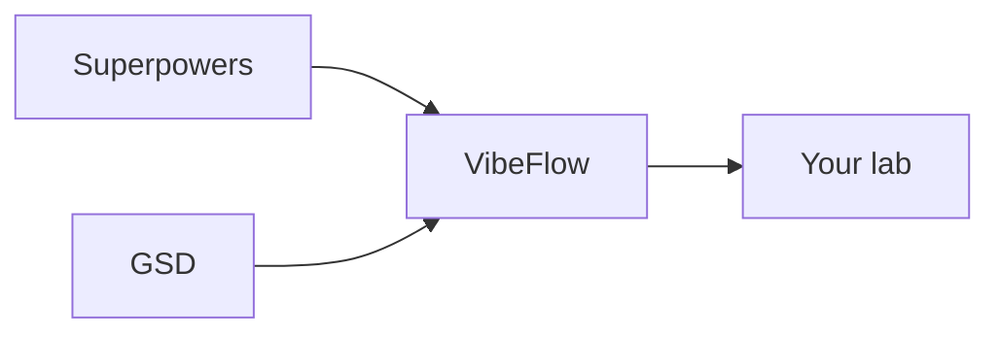

# VibeFlow, GSD, and Superpowers

<!-- vf-manual:lang -->
[Français](../../fr/02-concepts/vibeflow-gsd-superpowers.md) · **English**
<!-- /vf-manual:lang -->

VibeFlow's dev cycle rests entirely on an external engine, GSD, plus a companion piece,
Superpowers. Until this page, the only trace of that relationship anywhere in the repo was about
ten lines of `INSTALL.md`, written from the standpoint of uninstalling. This page says, for a
human, who does what — and why that changes what you type day to day.

The map below is **decorative** — the links aren't clickable. The list that follows carries the
real information.

## What GSD and Superpowers bring

- **GSD** (`@opengsd/gsd-core`) is the **planning engine** that tools the whole dev cycle: scoping
  a step, writing a verifiable plan, executing task by task with atomic commits, tracking progress
  in `.planning/STATE.md`. GSD is what knows what a phase, a plan, a requirement are — VibeFlow
  doesn't.
- **Superpowers** is a Claude Code plugin of general engineering skills — not VibeFlow-specific —
  things like TDD design, systematic debugging, plan writing, code review. VibeFlow calls on them
  inside its own cycle instead of reinventing what these skills already do well.

Without these two pieces, there's simply no tooled dev cycle: they're dependencies, not options.

Concretely, when a VibeFlow agent needs to write a verifiable plan, it relies on GSD's dedicated
plan-writing skill instead of improvising its own method; when it needs to debug unexpected
behavior, it relies on Superpowers' systematic-debugging skill. Neither GSD nor Superpowers knows
anything about VibeFlow or your line-of-work modules — they're generic pieces, reused as-is, never
rewritten.

That distinction matters if you're debugging unexpected behavior: a planning problem (a badly cut
phase, an inconsistent state) gets fixed on the GSD side; a general engineering-reasoning problem
(a fix loop that stops making progress) gets fixed on the Superpowers side; a team-orchestration
problem (an agent overstepping its mandate) gets fixed on VibeFlow's own side. Knowing which of
the three layers is at fault saves you from looking for a fix in the wrong place — and from
reporting a GSD problem as if it came from VibeFlow, or the other way around.

## What VibeFlow adds on top

This is the core of the product's value: saying "help me build this feature" is enough to trigger
the entire pipeline, **without ever having to know a single GSD command**. The `vibeflow-dev` agent
detects your natural-language intent and directly invokes whichever installed `gsd-*` and
`superpowers:*` pieces apply — you never need to know which one. On top of that base, VibeFlow adds
what neither GSD nor Superpowers provides on its own: a mission team (`vf-dev-manager` plus
cloistered workers) with a driver lock and parallel dispatch, a single entry-point skill (`vf-dev`)
instead of ten GSD commands to memorize, and a first-use guardrail that orients you before you get
lost in the tool chain.

**One engine per project.** A dev lab never runs two planning engines at once: GSD governs the
project, `planning-core` stays at lab altitude (index, debt, memory) and never rewrites what GSD
produces. The boundary is tested by a script, not left to interpretation: "does this concern the
project, or the lab?"

### A concrete example

Type "help me build authentication" in a dev lab. You'll never see `gsd-discuss-phase` or
`gsd-plan-phase` in what you type yourself — it's `vibeflow-dev` that chooses to invoke those GSD
skills behind the scenes, depending on where the project stands (first step, resuming after a
pause, a long mission to dispatch). The GSD command exists and works perfectly well if you know it
and prefer typing it directly — VibeFlow doesn't hide it, it just spares you having to know it.

## Without GSD, and who updates what

**If GSD isn't installed**, the dev agent installs it itself — non-interactively, scoped to the
same place as the rest of your lab — the moment you trigger an action that needs it. You normally
never have to install it by hand yourself. If, for whatever reason, that auto-install fails or is
declined, the tooled dev cycle simply doesn't fire: the `gsd-*` skills that `vibeflow-dev` tries to
invoke don't exist yet on your machine.

This auto-install never triggers project creation on its own initiative — it only lays down the
engine itself. Starting a new project stays an action you trigger explicitly, never something that
happens silently while you were asking for something else.

**Who updates what.** The GSD engine's state is now part of `/vf-update`'s diagnostic, on the same
footing as the plugin version and the module versions — it's no longer something you stumble on by
accident. Any migration (from an older package, say) is **proposed**, never forced: as with any
action touching a third-party install on your machine, VibeFlow waits for your explicit
confirmation before acting. Superpowers, on the other hand, stays **outside** `/vf-update`'s
scope — its update follows its own path (`claude plugin update`).

Keep the essential part: three pieces, three distinct responsibilities, a single entry point for
you. That last part — a single entry point — is VibeFlow's real added value on this topic. None of
the other two pieces disappear when VibeFlow sits on top of them; they just stop being something
you have to think about every day. If you ever want to go back to typing GSD or Superpowers
commands directly, nothing in this layering prevents it — VibeFlow adds a shortcut, it doesn't
take one away.

That's the whole relationship, in one sentence: two proven engines underneath, one voice on top.

<!-- vf-manual:nav -->
[← Previous](../02-concepts/agents-skills-and-commands.md) · [↑ Contents](../README.md) · [Next →](../02-concepts/the-nine-principles.md)
<!-- /vf-manual:nav -->
