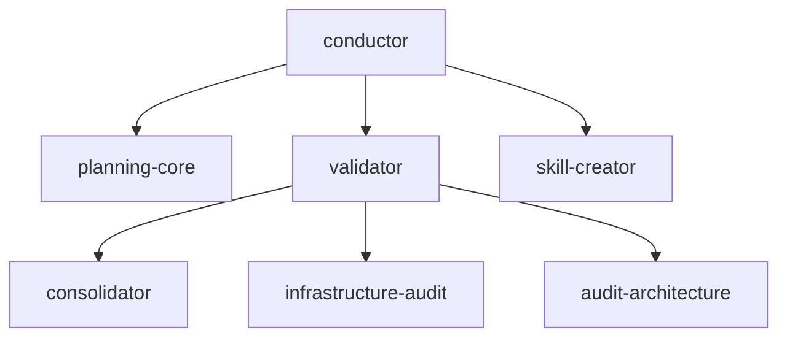

# The baseline and its dependencies

<!-- vf-manual:lang -->
[Français](../../fr/03-modules/socle-et-dependances.md) · **English**
<!-- /vf-manual:lang -->

You get to choose almost all your modules. Almost. A VibeFlow lab always lays down a core you don't
choose, and that core drags others along behind it. This page explains which one, why, and what
happens if you try to remove it.

As everywhere in this manual, the facts below were established by reading the `module.json` files
on disk — the `mandatory` field for the baseline, the `requires` field for dependencies. If you
want to check, open `plugin/conductor/module.json`: it's all there, in plain sight, in about ten
lines.

## One mandatory module, six pulled in

Exactly one module currently carries `"mandatory": true`: **`conductor`**. It's the lab's meta
orchestrator — the one that creates, configures, checks, and updates. The installer lays it down
**automatically**, without offering it in a list of checkboxes, and that's deliberate: a lab with
no consistency guardian has no safety net at all. You can remove everything except this one.

But `conductor` never comes alone. Its `requires` field declares three modules, which declare
others in turn. The full chain, exactly as written on disk:

- `conductor` needs `planning-core`, `validator`, and `skill-creator`;
- `validator` in turn needs `consolidator`, `infrastructure-audit`, and `audit-architecture`;
- `planning-core`, `skill-creator`, `consolidator`, `infrastructure-audit`, and
  `audit-architecture` ask for nothing: they're the leaves of the tree.

The result: asking for `conductor` lays down **seven modules**. Never one more, never one fewer
than what the chain declares. The diagram below is **decorative** — it only exists so you can see
the shape of the tree. The list above is the real information, and it's the one that counts.

You never have to walk that chain yourself. Before writing anything to your disk, the installer
resolves what's called the **transitive closure** — it follows every `requires` all the way down —
then shows you the complete list and waits for your confirmation. You see what's coming before it
comes.

## What this changes in practice

**You can't remove a module something else depends on.** If you ask to drop `consolidator` while
`validator` is installed, you'd break `validator`, therefore `conductor`, therefore the lab. The
tooling tells you so instead of letting you do it.

**Removal order is the reverse of install order.** To remove cleanly, you start at the leaves and
work up: first what nobody else needs, then what pulled it in. It's the same principle that
explains why you must remove the modules **before** the plugin itself — detailed in
[updating-and-uninstalling.md](../01-get-started/updating-and-uninstalling.md).

**Business bundles install on top of the baseline, never in its place.** All three declare the same
core dependencies — `conductor`, `planning-core`, `consolidator`, `audit-architecture`,
`validator` — which is, give or take one, the baseline itself. Picking a bundle is therefore never
a trade-off against the baseline: it's an addition.

**One less obvious dependency worth knowing**: `dev-orchestrator` declares `design-orchestrator` in
its `requires`. Installing the development module therefore also lays down the design one. That's
no accident — a dev cycle regularly runs into an interface phase, and the dev router needs to be
able to hand off rather than improvise design.

### Checking what's actually laid down on your machine

The chain described above is the one the manifests declare. What's **actually** laid down in your
lab may differ if you've added or removed things over time. To find out, don't guess: ask your lab
for the install state, or have it audited. Both gestures are described in
[enabling-and-disabling.md](./enabling-and-disabling.md).

The simplest landmark, if you just want a glance: installed modules leave identifiable files in
your scope's `.claude/` folder — skills on one side, agents on the other. An empty folder where you
expected a module is a sign the install happened at a different scope than the one you're looking
at.

## Why a baseline at all, rather than everything à la carte

Everything could have been made optional. The choice went the other way, for a simple reason: the
baseline capabilities are the ones that **catch the other modules' mistakes**. `validator` spots
drift, `infrastructure-audit` sees silent regressions, `consolidator` keeps memory from rotting,
`audit-architecture` imposes a control structure on the processes that produce. Making those four
optional would amount to offering a lab with no brakes — perfectly usable, right up until the day
it isn't.

One caveat though: **mandatory doesn't mean sufficient**. The baseline gives you a lab capable of
governing itself, not a lab that's productive in your line of work. It's `dev-orchestrator` that
makes a code lab genuinely operative, `content-bundle` that makes an editorial lab operative, and
so on. The baseline is the shared foundation; what tells your lab apart from someone else's, you
add on top — and [choosing-your-modules.md](./choosing-your-modules.md) helps you decide what.

<!-- vf-manual:nav -->
[← Previous](../03-modules/catalog.md) · [↑ Contents](../README.md) · [Next →](../03-modules/choosing-your-modules.md)
<!-- /vf-manual:nav -->
