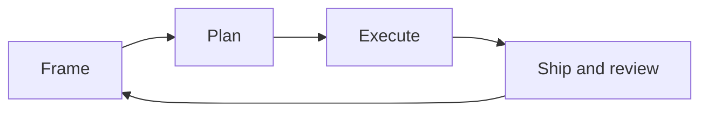

# The cycle at a glance

<!-- vf-manual:lang -->
[Français](../../fr/04-cycle-de-dev/le-cycle-en-bref.md) · **English**
<!-- /vf-manual:lang -->

Developing with VibeFlow means running through four movements: **framing**, **planning**,
**executing**, **shipping and reviewing**. This page gives you the map. The four pages that follow
detail each movement.

The most important thing to understand before reading on: **you don't need to know these four
movements to use them**. You speak normally, and the lab recognizes which moment you're in. "I have
an idea, can we talk it through?" opens a framing. "Go ahead, build it" starts an execution.
Commands exist, but they aren't the front door — they're the service entrance, for when you know
exactly what you want to trigger.

## The four movements

The diagram below is **decorative**: it shows the flow, but its boxes aren't clickable. The list
right after it is the real navigation.

- **Framing** → [framing-an-idea.md](./framing-an-idea.md). A conversation. It turns a fuzzy
  intention into a sharp scope: what's in, what's out, what's settled and what's deferred. Produces
  a context document.
- **Planning** → [planning.md](./planning.md). The scope becomes an ordered sequence of tasks,
  with verifiable success criteria. Produces a plan, reviewed before it's executed.
- **Executing** → [executing.md](./executing.md). The plan becomes code, task by task, with one
  commit per unit of work. Produces commits and a summary.
- **Shipping and reviewing** → [shipping-and-reviewing.md](./shipping-and-reviewing.md). The code goes through
  review, the documentation gets updated, and **you** look at what was done before it enters the
  main branch.

And a fifth gesture, which isn't a movement but a mode:
[autonomous-mode.md](./autonomous-mode.md) — delegating the full run of all four movements across
several steps, without sitting in front of the screen.

What travels from one movement to the next isn't your memory: it's a file on disk. Framing writes
down what it decided, planning reads it, execution reads the plan. That's why a session can be
interrupted and another one picks up without you re-explaining anything — the principle is
developed in [what-is-a-lab.md](../02-concepts/what-is-a-lab.md).

## What you say to move from one to the next

There's no formula to memorize. Here are real phrasings anyway, to give you the tone:

| What you want | What you can say |
|---|---|
| Open a fuzzy subject | "I have an idea but I don't know what I want yet" |
| Set a step's scope | "Frame this step", "what exactly is in scope?" |
| Arbitrate between approaches | "A or B?", "compare these two options" |
| Get a plan | "Plan this", "break the work down" |
| Start building | "Build this", "implement this feature", "go ahead" |
| A trivial fix | "Quick thing", "fix this typo" |
| Know where things stand | "Where are we?", "what's left?" |
| Delegate everything | "Run it autonomously", "I'll be back tomorrow, keep going" |

The lab may ask you a short question if it's torn between two readings. That's intended: a
ten-second question beats half an hour of work in the wrong direction.

## How long it takes, and when it's overkill

**How long.** A framing is measured in minutes of conversation. A plan takes a few minutes to
generate plus however long you spend reading it — that's the moment where your attention pays off
most. Execution is the long phase, and it's the one where you can go do something else. Review and
your own read-through take a few more minutes.

**When it's overkill.** The full cycle is meant for work that has a shape: a feature, a rework, a
bug whose cause isn't obvious. It's absurd for renaming a variable, fixing a typo in a label, or
adjusting a configuration value.

In those cases, just ask for the thing. "Fix this typo in the heading", "rename this field": the
lab recognizes a trivial task and does it directly, with a clean commit and the tracking kept up to
date, without dragging you through a framing and a plan for three characters. You keep the
guarantees — atomic commit, coherent project state — without the ceremony.

The boundary isn't a strict rule, and you don't have to compute it. A good question when you're
unsure: **could I say in advance, in one sentence, what the result will look like?** If yes, ask
for it directly. If no, that's exactly the sign that framing will save you time.

Finally, a common case that fits neither box: the bug whose cause you don't understand. It isn't a
trivial task, because you don't know what needs changing; it isn't a full cycle either, because
there's nothing to frame while the cause is unknown. Just say what you observe — "when I click this
button, the screen freezes" — and let the cause be found before any fix is attempted. Once the
cause is known, you fall back into one of the two boxes above, and this time you know which one.

Finding the cause before proposing a fix isn't a courtesy: it's what prevents the kind of fix that
moves a problem somewhere else instead of
solving it.

<!-- vf-manual:nav -->
[← Previous](../03-modules/where-a-module-lives.md) · [↑ Contents](../README.md) · [Next →](../04-development-cycle/framing-an-idea.md)
<!-- /vf-manual:nav -->
