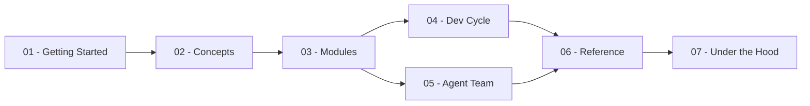

# The VibeFlow Manual — English

<!-- vf-manual:lang -->
[Français](../fr/README.md) · **English**
<!-- /vf-manual:lang -->

This manual is for you if you're **discovering VibeFlow**, or if you already use it and want to
understand what's happening under the hood. It isn't for a Claude Code agent — `docs/` and
`.planning/` are written for that. Everything here is written for a human: complete sentences,
copyable examples, no technical term used before it's defined.

You won't find anything here that's already in the repo's `README.md` or in `docs/`: this manual
tells the story of **usage** — installing, understanding a lab, running your first agents — while
the README tells the story of the project and `docs/` holds the agents' working memory.

## Map of the manual

The map below is **decorative**: it shows the manual's 7 themes and how they flow into each
other, but the links aren't clickable (diagrams rendered by GitHub break links and icons). The
**list right below it** is the real navigation.

## Guided paths

- **I'm discovering, I'm installing** → [01-get-started/prerequisites.md](./01-get-started/prerequisites.md)
- **I just want to see it work** → [01-get-started/your-first-lab.md](./01-get-started/your-first-lab.md)
- **I want to understand the full lifecycle** →
  [01-get-started/updating-and-uninstalling.md](./01-get-started/updating-and-uninstalling.md)
- **I want to understand before I act** →
  [02-concepts/what-is-a-lab.md](./02-concepts/what-is-a-lab.md)
- **I'm composing my lab** →
  [03-modules/choosing-your-modules.md](./03-modules/choosing-your-modules.md)
- **I'm developing** →
  [04-development-cycle/the-cycle-at-a-glance.md](./04-development-cycle/the-cycle-at-a-glance.md)
- **I'm starting a long mission** →
  [05-agent-team/what-is-asked-of-you.md](./05-agent-team/what-is-asked-of-you.md)
- **I'm looking for a command or a troubleshooting fix** →
  [06-reference/commands.md](./06-reference/commands.md)
- **I want to see the mechanics** →
  [07-under-the-hood/anatomy-of-an-installed-lab.md](./07-under-the-hood/anatomy-of-an-installed-lab.md)

<!-- vf-manual:sommaire -->
### Getting Started
- [Prerequisites](./01-get-started/prerequisites.md)
- [Installation](./01-get-started/installation.md)
- [Choosing your scope](./01-get-started/choosing-your-scope.md)
- [Your first session](./01-get-started/your-first-session.md)
- [Your first lab](./01-get-started/your-first-lab.md)
- [Updating and uninstalling](./01-get-started/updating-and-uninstalling.md)
- [Troubleshooting — installation](./01-get-started/installation-troubleshooting.md)
### Concepts
- [What is a lab?](./02-concepts/what-is-a-lab.md)
- [Modules and bundles](./02-concepts/modules-and-bundles.md)
- [Agents, skills, and commands](./02-concepts/agents-skills-and-commands.md)
- [VibeFlow, GSD, and Superpowers](./02-concepts/vibeflow-gsd-and-superpowers.md)
- [The nine principles](./02-concepts/the-nine-principles.md)
- [Gates and human validation](./02-concepts/gates-and-human-validation.md)
- [Glossary](./02-concepts/glossary.md)
### Modules
- [Module catalog](./03-modules/catalog.md)
- [The baseline and its dependencies](./03-modules/baseline-and-dependencies.md)
- [Choosing your modules](./03-modules/choosing-your-modules.md)
- [Business bundles](./03-modules/business-bundles.md)
- [Enabling, disabling, changing your mind](./03-modules/enabling-and-disabling.md)
- [Where a module lives](./03-modules/where-a-module-lives.md)
### Development cycle
- [The cycle at a glance](./04-development-cycle/the-cycle-at-a-glance.md)
- [Framing an idea](./04-development-cycle/framing-an-idea.md)
- [Planning](./04-development-cycle/planning.md)
- [Executing](./04-development-cycle/executing.md)
- [Shipping and reviewing](./04-development-cycle/shipping-and-reviewing.md)
- [Autonomous mode](./04-development-cycle/autonomous-mode.md)
### Agent team
- [Why a team](./05-agent-team/why-a-team.md)
- [The agents that ship](./05-agent-team/the-agents-that-ship.md)
- [A long mission, the mechanics](./05-agent-team/a-long-mission.md)
- [What's asked of you](./05-agent-team/what-is-asked-of-you.md)
- [Branches and worktrees](./05-agent-team/branches-and-worktrees.md)
- [Specialized teams](./05-agent-team/specialized-teams.md)
### Reference
- [Commands](./06-reference/commands.md)
- [Skills](./06-reference/skills.md)
- [Agents](./06-reference/agents.md)
- [Cost and models](./06-reference/cost-and-models.md)
- [Troubleshooting](./06-reference/troubleshooting.md)
- [Where to find what](./06-reference/where-to-find-what.md)
### Under the hood
- [Anatomy of an installed lab](./07-under-the-hood/anatomy-of-an-installed-lab.md)
- [The install engine](./07-under-the-hood/the-install-engine.md)
- [The machine gates](./07-under-the-hood/the-machine-gates.md)
- [The doctrine and its patterns](./07-under-the-hood/the-doctrine-and-its-patterns.md)
- [Architecture decisions](./07-under-the-hood/architecture-decisions.md)
- [Contributing and going further](./07-under-the-hood/contributing-and-going-further.md)
<!-- /vf-manual:sommaire -->
