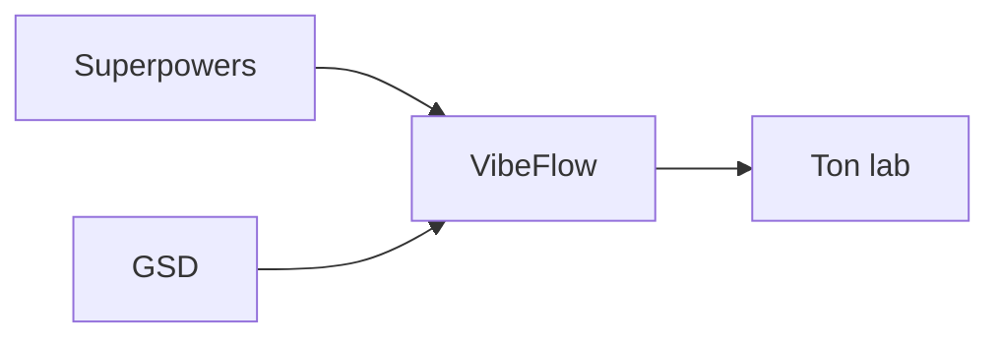

# VibeFlow, GSD et Superpowers

<!-- vf-manual:lang -->
**Français** · [English](../../en/02-concepts/vibeflow-gsd-and-superpowers.md)
<!-- /vf-manual:lang -->

Le cycle de dev de VibeFlow repose entièrement sur un moteur externe, GSD, et une brique
complémentaire, Superpowers. Jusqu'à cette page, la seule trace de cette relation dans tout le
repo tenait en une dizaine de lignes d'`INSTALL.md`, écrites du point de vue de la
désinstallation. Cette page dit, pour un humain, qui fait quoi — et pourquoi ça change ce que tu
tapes au quotidien.

La carte ci-dessous est **décorative** — les liens n'y sont pas cliquables. La liste qui suit
porte l'information réelle.

## Ce qu'apportent GSD et Superpowers

- **GSD** (`@opengsd/gsd-core`) est le **moteur de planning** qui outille tout le cycle de dev :
  cadrage d'une étape, écriture d'un plan vérifiable, exécution tâche par tâche avec commits
  atomiques, suivi de l'avancement dans `.planning/STATE.md`. C'est GSD qui sait ce qu'est une
  phase, un plan, une exigence — pas VibeFlow.
- **Superpowers** est un plugin Claude Code de compétences d'ingénierie générales — pas propre à
  VibeFlow — comme la conception TDD, le debug systématique, l'écriture de plans, la revue de
  code. VibeFlow les invoque à l'intérieur de son propre cycle plutôt que de réinventer ce que ces
  compétences font déjà bien.

Sans ces deux briques, il n'y a tout simplement pas de cycle de dev outillé : ce sont des
dépendances, pas des options.

Concrètement, quand un agent VibeFlow a besoin d'écrire un plan vérifiable, il s'appuie sur le
skill GSD dédié à l'écriture de plans plutôt que d'improviser sa propre méthode ; quand il doit
déboguer un comportement inattendu, il s'appuie sur le skill Superpowers de debug systématique. Ni
GSD ni Superpowers ne connaissent VibeFlow ni tes modules métier — ce sont des briques génériques,
réutilisées telles quelles, jamais réécrites.

C'est une distinction qui compte si tu débogues un comportement inattendu : un problème de
planning (une phase mal découpée, un état incohérent) se règle côté GSD ; un problème de
raisonnement d'ingénierie générale (une boucle de correction qui n'avance plus) se règle côté
Superpowers ; un problème d'orchestration d'équipe (un agent qui dépasse son mandat) se règle côté
VibeFlow lui-même. Savoir laquelle des trois couches est en cause t'évite de chercher un correctif
au mauvais endroit — et t'évite aussi de rapporter un problème GSD comme s'il venait de VibeFlow,
ou l'inverse.

## Ce que VibeFlow ajoute par-dessus

C'est là le cœur de la valeur du produit : dire « aide-moi à développer cette fonctionnalité »
suffit à déclencher tout le pipeline, **sans jamais avoir à connaître une seule commande GSD**.
L'agent `vibeflow-dev` détecte ton intention en langage naturel et invoque directement les briques
`gsd-*` et `superpowers:*` installées — toi, tu n'as jamais besoin de savoir laquelle. Par-dessus
ce socle, VibeFlow ajoute ce que ni GSD ni Superpowers ne fournissent seuls : une équipe de
mission (`vf-dev-manager` + workers cloisonnés) avec verrou de driver et dispatch parallèle, un
skill d'entrée unique (`vf-dev`) au lieu de dix commandes GSD à mémoriser, et un garde-fou de
première utilisation qui t'oriente avant que tu ne te perdes dans la chaîne d'outils.

**Un seul moteur par projet.** Un lab dev n'utilise jamais deux moteurs de planning à la fois :
GSD gouverne le projet, `planning-core` reste à l'altitude du lab (index, dette, mémoire) sans
jamais réécrire ce que GSD produit. La frontière est testée par un script, pas laissée à
l'interprétation : « est-ce que ça concerne le projet, ou le lab ? »

### Un exemple concret

Tape « aide-moi à développer l'authentification » dans un lab dev. Tu ne verras jamais
`gsd-discuss-phase` ni `gsd-plan-phase` dans ce que tu tapes toi-même — c'est `vibeflow-dev` qui
choisit d'invoquer ces skills GSD en coulisse, selon où en est le projet (première étape,
reprise après une pause, mission longue à dispatcher). La commande GSD existe et fonctionne très
bien si tu la connais et préfères la taper directement — VibeFlow ne la cache pas, il te dispense
juste de devoir la connaître.

## Sans GSD, et qui met à jour quoi

**Si GSD n'est pas installé**, l'agent de dev l'installe lui-même — de façon non interactive,
scopée au même endroit que le reste de ton lab — dès que tu déclenches une action qui en a besoin.
Tu n'as normalement jamais à l'installer toi-même à la main. Si, pour une raison quelconque, cette
auto-installation échoue ou est refusée, le cycle de dev outillé ne se déclenche simplement pas :
les skills `gsd-*` que `vibeflow-dev` cherche à invoquer n'existent pas encore sur ta machine.

Cette auto-installation ne lance jamais, de sa propre initiative, la création d'un projet — elle
pose seulement le moteur lui-même. Démarrer un nouveau projet reste une action que tu déclenches
explicitement, jamais quelque chose qui se produit en silence pendant que tu demandais autre
chose.

**Qui met à jour quoi.** L'état du moteur GSD fait désormais partie du diagnostic de `/vf-update`,
au même titre que la version du plugin et celle des modules — ce n'est plus une chose que tu
découvres par hasard. Une migration éventuelle (par exemple depuis un ancien paquet) est
**proposée**, jamais imposée : comme pour toute action qui touche à une installation tierce sur ta
machine, VibeFlow attend ta confirmation explicite avant d'agir. Superpowers, lui, reste **hors du
périmètre** de `/vf-update` — sa mise à jour suit sa propre voie (`claude plugin update`).

Retiens l'essentiel : trois briques, trois responsabilités distinctes, un seul point d'entrée pour
toi. C'est cette dernière partie — un seul point d'entrée — qui est la vraie valeur ajoutée de
VibeFlow sur ce sujet. Aucune des deux briques ne disparaît quand VibeFlow se pose par-dessus :
elles cessent seulement d'être quelque chose auquel tu dois penser au quotidien. Si tu veux un jour
revenir à taper des commandes GSD ou Superpowers directement, rien dans cette superposition ne t'en
empêche — VibeFlow ajoute un raccourci, il n'en retire aucun.

Toute la relation tient en une phrase : deux moteurs éprouvés en dessous, une seule voix au-dessus.

<!-- vf-manual:nav -->
[← Précédent](../02-concepts/agents-skills-commandes.md) · [↑ Sommaire](../README.md) · [Suivant →](../02-concepts/les-9-principes.md)
<!-- /vf-manual:nav -->
