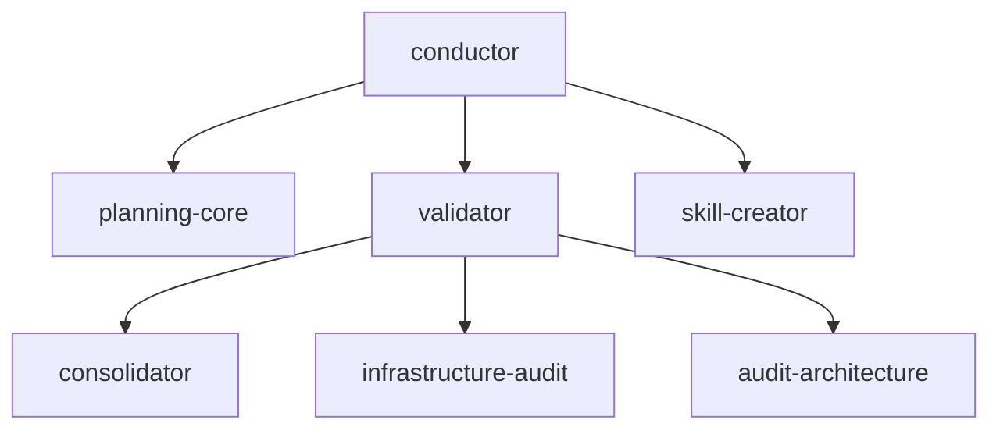

# Le socle et les dépendances

<!-- vf-manual:lang -->
**Français** · [English](../../en/03-modules/baseline-and-dependencies.md)
<!-- /vf-manual:lang -->

Tu peux choisir presque tous tes modules. Presque. Un lab VibeFlow pose toujours un noyau que tu ne
choisis pas, et ce noyau en entraîne d'autres derrière lui. Cette page explique lequel, pourquoi, et
ce qui se passe si tu essaies de l'enlever.

Comme partout dans ce manuel, les faits ci-dessous ont été établis en lisant les `module.json` du
disque — champ `mandatory` pour le socle, champ `requires` pour les dépendances. Si tu veux
vérifier, ouvre `plugin/conductor/module.json` : tout est là, en clair, en une dizaine de lignes.

## Un seul module obligatoire, six entraînés

Un seul module porte aujourd'hui `"mandatory": true` : **`conductor`**. C'est l'orchestrateur méta
du lab — celui qui crée, configure, vérifie et met à jour. L'installeur le pose **d'office**, sans
te le proposer dans une liste de cases à cocher, et c'est délibéré : un lab sans son gardien de
cohérence n'a aucun filet. Tu peux tout retirer sauf lui.

Mais `conductor` ne vient jamais seul. Son champ `requires` déclare trois modules, qui en déclarent
d'autres à leur tour. La chaîne complète, telle qu'elle est écrite sur le disque :

- `conductor` a besoin de `planning-core`, `validator` et `skill-creator` ;
- `validator` a besoin à son tour de `consolidator`, `infrastructure-audit` et
  `audit-architecture` ;
- `planning-core`, `skill-creator`, `consolidator`, `infrastructure-audit` et `audit-architecture`
  ne demandent rien : ce sont les feuilles de l'arbre.

Résultat : demander `conductor` pose **sept modules**. Jamais un de plus, jamais un de moins que ce
que la chaîne déclare. Le schéma ci-dessous est **décoratif** — il ne sert qu'à voir la forme de
l'arbre. La liste au-dessus est l'information réelle, et c'est elle qui fait foi.

Tu n'as jamais à calculer cette chaîne toi-même. Avant d'écrire quoi que ce soit sur ton disque,
l'installeur résout ce qu'on appelle la **fermeture transitive** — il descend chaque `requires`
jusqu'au bout — puis te récapitule la liste complète et attend ta confirmation. Tu vois ce qui
arrive avant que ça n'arrive.

## Ce que ça change concrètement

**Tu ne peux pas retirer un module dont un autre dépend.** Si tu demandes le retrait de
`consolidator` alors que `validator` est installé, tu casserais `validator`, donc `conductor`, donc
le lab. L'outillage te le dit plutôt que de te laisser faire.

**L'ordre du retrait est l'inverse de celui de l'install.** Pour retirer proprement, on part des
feuilles et on remonte : d'abord ce qui ne sert à personne d'autre, ensuite ce qui l'entraînait.
C'est le même principe qui explique pourquoi il faut retirer les modules **avant** le plugin
lui-même — détaillé dans
[mettre-a-jour-et-desinstaller.md](../01-demarrer/mettre-a-jour-et-desinstaller.md).

**Les bundles métier s'installent par-dessus le socle, jamais à sa place.** Les trois déclarent les
mêmes dépendances de fond — `conductor`, `planning-core`, `consolidator`, `audit-architecture`,
`validator` — c'est-à-dire, à une nuance près, le socle lui-même. Choisir un bundle n'est donc
jamais un arbitrage contre le socle : c'est un ajout.

**Une dépendance moins évidente à connaître** : `dev-orchestrator` déclare `design-orchestrator`
dans ses `requires`. Installer le module de développement pose donc aussi celui de design. Ce n'est
pas un accident — un cycle de dev croise régulièrement une phase d'interface, et le routeur dev
doit pouvoir passer la main plutôt que d'improviser du design.

### Vérifier ce qui est réellement posé chez toi

La chaîne décrite ci-dessus est celle déclarée par les manifestes. Ce qui est **réellement** posé
dans ton lab peut différer si tu as ajouté ou retiré des choses au fil du temps. Pour le savoir, ne
devine pas : demande l'état de l'installation à ton lab, ou fais-le auditer. Les deux gestes sont
décrits en [activer-desactiver.md](./activer-desactiver.md).

Le repère le plus simple, si tu veux juste jeter un œil : les modules posés laissent des fichiers
identifiables dans le dossier `.claude/` de ton scope — les skills d'un côté, les agents de
l'autre. Un dossier vide là où tu attendais un module est un signe que l'install s'est faite à un
autre scope que celui que tu regardes.

## Pourquoi un socle, plutôt que tout à la carte

On aurait pu rendre tout optionnel. Le choix a été inverse, pour une raison simple : les capacités
du socle sont celles qui **rattrapent les erreurs des autres**. Le `validator` détecte les dérives,
l'`infrastructure-audit` voit les régressions silencieuses, le `consolidator` empêche la mémoire de
pourrir, l'`audit-architecture` impose une structure de contrôle aux process qui produisent. Rendre
ces quatre-là optionnels reviendrait à proposer un lab sans freins — utilisable, jusqu'au jour où
ça ne l'est plus.

Attention toutefois : **obligatoire ne veut pas dire suffisant**. Le socle te donne un lab capable
de se gouverner, pas un lab productif dans ton métier. C'est `dev-orchestrator` qui rend un lab de
code réellement opérant, `content-bundle` qui rend un lab éditorial opérant, et ainsi de suite. Le
socle est la fondation commune ; ce qui distingue ton lab d'un autre, tu l'ajoutes par-dessus — et
[choisir-ses-modules.md](./choisir-ses-modules.md) t'aide à décider quoi.

<!-- vf-manual:nav -->
[← Précédent](../03-modules/catalogue.md) · [↑ Sommaire](../README.md) · [Suivant →](../03-modules/choisir-ses-modules.md)
<!-- /vf-manual:nav -->
