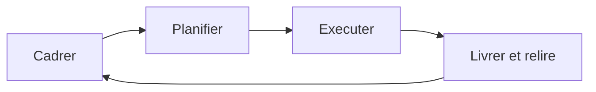

# Le cycle en bref

<!-- vf-manual:lang -->
**Français** · [English](../../en/04-development-cycle/the-cycle-at-a-glance.md)
<!-- /vf-manual:lang -->

Développer avec VibeFlow, c'est enchaîner quatre temps : **cadrer**, **planifier**, **exécuter**,
**livrer et relire**. Cette page te donne la carte. Les quatre pages suivantes détaillent chaque
temps.

La chose la plus importante à comprendre avant de lire la suite : **tu n'as pas à connaître ces
quatre temps pour t'en servir**. Tu parles normalement, et le lab reconnaît le moment où tu es.
« J'ai une idée, on en parle ? » ouvre un cadrage. « Vas-y, code ça » lance une exécution. Les
commandes existent, mais elles ne sont pas la porte d'entrée — elles sont la porte de service, pour
quand tu sais exactement ce que tu veux déclencher.

## Les quatre temps

Le schéma ci-dessous est **décoratif** : il montre l'enchaînement, mais ses cases ne sont pas
cliquables. La liste juste après est la vraie navigation.

- **Cadrer** → [cadrer-une-idee.md](./cadrer-une-idee.md). Une conversation. Elle transforme une
  intention floue en périmètre net : ce qu'on fait, ce qu'on ne fait pas, ce qui est tranché et ce
  qui est reporté. Produit un document de contexte.
- **Planifier** → [planifier.md](./planifier.md). Le périmètre devient une suite de tâches
  ordonnées, avec des critères de réussite vérifiables. Produit un plan, relu avant d'être exécuté.
- **Exécuter** → [executer.md](./executer.md). Le plan devient du code, tâche par tâche, avec un
  commit par unité de travail. Produit des commits et un résumé.
- **Livrer et relire** → [livrer-et-relire.md](./livrer-et-relire.md). Le code passe en revue, la
  documentation se met à jour, et **tu** regardes ce qui a été fait avant que ça n'entre dans la
  branche principale.

Et un cinquième geste, qui n'est pas un temps mais un mode :
[mode-autonome.md](./mode-autonome.md) — déléguer l'enchaînement complet des quatre temps sur
plusieurs étapes, sans être devant l'écran.

Ce qui circule d'un temps à l'autre, ce n'est pas ta mémoire : c'est un fichier sur le disque. Le
cadrage écrit ce qu'il a décidé, le plan le lit, l'exécution lit le plan. C'est pour ça qu'une
session peut s'interrompre et qu'une autre reprend sans que tu réexpliques quoi que ce soit — le
principe est développé en [qu-est-ce-qu-un-lab.md](../02-concepts/qu-est-ce-qu-un-lab.md).

## Ce que tu dis pour passer de l'un à l'autre

Tu n'as aucune formule à retenir. Voici néanmoins des formulations réelles, pour te donner le ton :

| Ce que tu veux | Ce que tu peux dire |
|---|---|
| Ouvrir un sujet flou | « J'ai une idée mais je ne sais pas encore ce que je veux » |
| Fixer le périmètre d'une étape | « Cadre cette étape », « c'est quoi exactement le périmètre ? » |
| Arbitrer entre deux approches | « A ou B ? », « compare ces deux options » |
| Obtenir un plan | « Planifie ça », « découpe le travail » |
| Lancer la construction | « Code ça », « implémente cette fonctionnalité », « vas-y » |
| Une correction triviale | « Petit truc vite fait », « corrige cette typo » |
| Savoir où on en est | « On en est où ? », « qu'est-ce qui reste ? » |
| Tout déléguer | « Fais tout en autonomie », « je reviens demain, avance » |

Le lab peut te poser une question courte s'il hésite entre deux interprétations. C'est voulu :
mieux vaut une question de dix secondes qu'une demi-heure de travail dans la mauvaise direction.

## Combien de temps, et quand c'est disproportionné

**Combien de temps.** Un cadrage se compte en minutes de conversation. Un plan, quelques minutes de
génération plus le temps que tu prends à le relire — c'est le moment où ton attention rapporte le
plus. L'exécution est la phase longue, et c'est celle où tu peux partir faire autre chose. La revue
et ta relecture reprennent quelques minutes.

**Quand c'est disproportionné.** Le cycle complet est fait pour un travail qui a une forme : une
fonctionnalité, une refonte, une correction dont la cause n'est pas évidente. Il est absurde pour
renommer une variable, corriger une faute dans un libellé, ou ajuster une valeur de configuration.

Dans ces cas-là, demande simplement la chose. « Corrige cette typo dans le titre », « renomme ce
champ » : le lab reconnaît une tâche triviale et l'exécute directement, avec un commit propre et le
suivi à jour, sans te faire traverser un cadrage et un plan pour trois caractères. Tu gardes les
garanties — commit atomique, état du projet cohérent — sans la cérémonie.

La frontière n'est pas une règle stricte, et tu n'as pas à la calculer. Une bonne question quand tu
hésites : **est-ce que je saurais dire à l'avance, en une phrase, à quoi ressemblera le résultat ?**
Si oui, demande-le directement. Si non, c'est exactement le signe qu'un cadrage va te faire gagner
du temps.

Enfin, un cas fréquent qui n'entre dans aucune des deux cases : le bug dont tu ne comprends pas la
cause. Ce n'est pas une tâche triviale, parce que tu ne sais pas ce qu'il faut changer ; ce n'est
pas non plus un cycle complet, parce qu'il n'y a rien à cadrer tant que la cause est inconnue. Dis
simplement ce que tu observes — « quand je clique sur ce bouton, l'écran se fige » — et laisse la
recherche de cause se faire avant toute correction. Une fois la cause connue, tu retombes dans
l'une des deux cases précédentes, et cette fois tu sais laquelle. Chercher la cause avant de
proposer un correctif n'est pas une politesse : c'est ce qui évite les corrections qui déplacent le
problème au lieu de le régler.

<!-- vf-manual:nav -->
[← Précédent](../03-modules/ou-vit-un-module.md) · [↑ Sommaire](../README.md) · [Suivant →](../04-cycle-de-dev/cadrer-une-idee.md)
<!-- /vf-manual:nav -->
