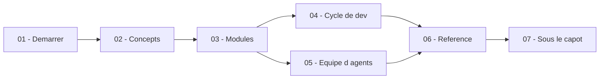

# Le manuel VibeFlow — Français

<!-- vf-manual:lang -->
**Français** · [English](../en/README.md)
<!-- /vf-manual:lang -->

Ce manuel s'adresse à toi si tu **découvres VibeFlow** ou si tu l'utilises déjà et veux comprendre
ce qui se passe sous le capot. Il ne s'adresse pas à un agent Claude Code — `docs/` et
`.planning/` sont écrits pour ça. Ici, tout est écrit pour un humain : phrases complètes, exemples
copiables, aucun mot technique employé sans être défini au passage.

Tu n'y trouveras rien qui se trouve déjà dans le `README.md` du dépôt ou dans `docs/` : ce manuel
raconte l'**usage** — installer, comprendre un lab, faire tourner tes premiers agents — là où le
README raconte le projet et `docs/` porte la mémoire de travail des agents.

## Carte du manuel

La carte ci-dessous est **décorative** : elle montre les 7 thèmes du manuel et comment ils
s'enchaînent, mais les liens n'y sont pas cliquables (les diagrammes rendus par GitHub cassent les
liens et les icônes). La **liste juste en dessous** est la vraie navigation.

## Parcours guidés

- **Je découvre, j'installe** → [01-demarrer/prerequis.md](./01-demarrer/prerequis.md)
- **Je veux juste voir ça tourner** → [01-demarrer/premier-lab.md](./01-demarrer/premier-lab.md)
- **Je veux comprendre le cycle de vie complet** →
  [01-demarrer/mettre-a-jour-et-desinstaller.md](./01-demarrer/mettre-a-jour-et-desinstaller.md)
- **Je veux comprendre avant d'agir** →
  [02-concepts/qu-est-ce-qu-un-lab.md](./02-concepts/qu-est-ce-qu-un-lab.md)
- **Je compose mon lab** →
  [03-modules/choisir-ses-modules.md](./03-modules/choisir-ses-modules.md)
- **Je développe** →
  [04-cycle-de-dev/le-cycle-en-bref.md](./04-cycle-de-dev/le-cycle-en-bref.md)
- **Je lance une longue mission** →
  [05-equipe-agents/ce-qu-on-vous-demande.md](./05-equipe-agents/ce-qu-on-vous-demande.md)
- **Je cherche une commande ou une panne** →
  [06-reference/commandes.md](./06-reference/commandes.md)
- **Je veux voir la mécanique** →
  [07-sous-le-capot/anatomie-d-un-lab-installe.md](./07-sous-le-capot/anatomie-d-un-lab-installe.md)

<!-- vf-manual:sommaire -->
### Démarrer
- [Prérequis](./01-demarrer/prerequis.md)
- [Installation](./01-demarrer/installation.md)
- [Choisir son scope](./01-demarrer/choisir-son-scope.md)
- [Première session](./01-demarrer/premiere-session.md)
- [Premier lab](./01-demarrer/premier-lab.md)
- [Mettre à jour et désinstaller](./01-demarrer/mettre-a-jour-et-desinstaller.md)
- [Dépannage — installation](./01-demarrer/depannage-installation.md)
### Concepts
- [Qu'est-ce qu'un lab ?](./02-concepts/qu-est-ce-qu-un-lab.md)
- [Modules et bundles](./02-concepts/modules-et-bundles.md)
- [Agents, skills et commandes](./02-concepts/agents-skills-commandes.md)
- [VibeFlow, GSD et Superpowers](./02-concepts/vibeflow-gsd-superpowers.md)
- [Les neuf principes](./02-concepts/les-9-principes.md)
- [Gates et validation humaine](./02-concepts/gates-et-validation-humaine.md)
- [Glossaire](./02-concepts/glossaire.md)
### Modules
- [Catalogue des modules](./03-modules/catalogue.md)
- [Le socle et les dépendances](./03-modules/socle-et-dependances.md)
- [Choisir ses modules](./03-modules/choisir-ses-modules.md)
- [Les bundles métier](./03-modules/bundles-metier.md)
- [Activer, désactiver, changer d'avis](./03-modules/activer-desactiver.md)
- [Où vit un module](./03-modules/ou-vit-un-module.md)
### Cycle de développement
- [Le cycle en bref](./04-cycle-de-dev/le-cycle-en-bref.md)
- [Cadrer une idée](./04-cycle-de-dev/cadrer-une-idee.md)
- [Planifier](./04-cycle-de-dev/planifier.md)
- [Exécuter](./04-cycle-de-dev/executer.md)
- [Livrer et relire](./04-cycle-de-dev/livrer-et-relire.md)
- [Le mode autonome](./04-cycle-de-dev/mode-autonome.md)
### Équipe d'agents
- [Pourquoi une équipe](./05-equipe-agents/pourquoi-une-equipe.md)
- [Les agents livrés](./05-equipe-agents/les-agents-livres.md)
- [Une mission longue, la mécanique](./05-equipe-agents/une-mission-longue.md)
- [Ce qu'on vous demande](./05-equipe-agents/ce-qu-on-vous-demande.md)
- [Branches et worktrees](./05-equipe-agents/branches-et-worktrees.md)
- [Équipes spécialisées](./05-equipe-agents/equipes-specialisees.md)
### Référence
- [Commandes](./06-reference/commandes.md)
- [Skills](./06-reference/skills.md)
- [Agents](./06-reference/agents.md)
- [Coûts et modèles](./06-reference/couts-et-modeles.md)
- [Dépannage](./06-reference/depannage.md)
- [Où trouver quoi](./06-reference/ou-trouver-quoi.md)
### Sous le capot
- [Anatomie d'un lab installé](./07-sous-le-capot/anatomie-d-un-lab-installe.md)
- [L'engine d'installation](./07-sous-le-capot/l-engine-d-install.md)
- [Les gates machine](./07-sous-le-capot/les-gates-machine.md)
- [La doctrine et ses patterns](./07-sous-le-capot/la-doctrine-et-ses-patterns.md)
- [Décisions d'architecture](./07-sous-le-capot/decisions-d-architecture.md)
- [Contribuer et aller plus loin](./07-sous-le-capot/contribuer-et-aller-plus-loin.md)
<!-- /vf-manual:sommaire -->
